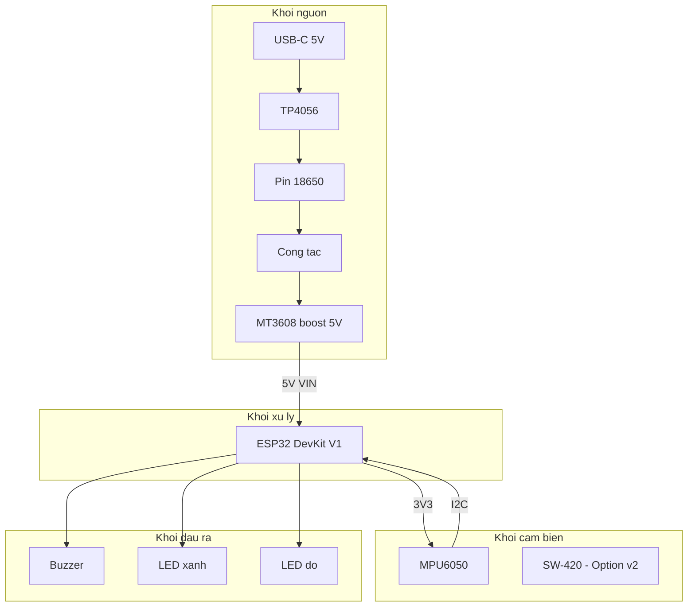

# 02 - Phần cứng

## Mục lục

- [1. Tổng quan phần cứng](#1-tổng-quan-phần-cứng)
- [2. Bảng vật tư (Bill of Materials)](#2-bảng-vật-tư-bill-of-materials)
- [3. Mô tả từng linh kiện](#3-mô-tả-từng-linh-kiện)
- [4. Sơ đồ khối phần cứng](#4-sơ-đồ-khối-phần-cứng)
- [5. Bảng pinout ESP32](#5-bảng-pinout-esp32)
- [6. Sơ đồ nối dây chi tiết](#6-sơ-đồ-nối-dây-chi-tiết)
- [7. Khối nguồn và sạc pin](#7-khối-nguồn-và-sạc-pin)
- [8. Lưu ý quan trọng khi lắp ráp](#8-lưu-ý-quan-trọng-khi-lắp-ráp)
- [9. Vỏ hộp](#9-vỏ-hộp)

---

## 1. Tổng quan phần cứng

Thiết bị gồm 4 khối chức năng chính:

1. **Khối xử lý trung tâm**: ESP32 DevKit V1.
2. **Khối cảm biến đầu vào**: MPU6050 (I2C) (Cảm biến rung SW-420 được trì hoãn sang phiên bản sau).
3. **Khối báo động đầu ra**: buzzer active + 2 LED trạng thái (xanh / đỏ).
4. **Khối nguồn**: pin 18650 + module TP4056 + công tắc nguồn chính.

Toàn bộ các khối được lắp trên 1 breadboard nhỏ 400 lỗ (phiên bản prototype)
hoặc PCB perfboard 5 x 7 cm (phiên bản hoàn thiện).

## 2. Bảng vật tư (Bill of Materials)

| # | Linh kiện | Model / Thông số | SL | Đơn giá (VND) | Thành tiền | Mục đích | Gợi ý nơi mua |
|---|-----------|------------------|----|---------------|------------|----------|----------------|
| 1 | Vi điều khiển | ESP32 DevKit V1 (30 chân) | 1 | 120.000 | 120.000 | Bộ não, xử lý WiFi | Shopee, Hshop, LinhKien |
| 2 | Cảm biến gia tốc | MPU6050 module GY-521 | 1 | 25.000 | 25.000 | Đo gia tốc 3 trục + gyro | Hshop, Icdayroi |
| 3 | Cảm biến rung | SW-420 module | 0 (Trì hoãn) | 15.000 | 0 | Phát hiện va chạm (Option v2) | Hshop |
| 4 | Còi | Active buzzer 5V (có sẵn mạch dao động) | 1 | 10.000 | 10.000 | Báo động âm thanh | Hshop |
| 5 | LED | LED 5mm (xanh + đỏ) + điện trở 220 Ohm | 2 | 2.500 | 5.000 | Hiển thị trạng thái | Hshop |
| 6 | Pin lithium | Pin 18650 2000-2600 mAh | 1 | 45.000 | 45.000 | Cấp nguồn di động | Hshop |
| 7 | Giá đỡ pin | Holder 18650 1 cell có dây | 1 | 10.000 | 10.000 | Giữ pin 18650 | Hshop |
| 8 | Module sạc | TP4056 có mạch bảo vệ (USB-C) | 1 | 20.000 | 20.000 | Sạc pin 18650 qua USB | Hshop |
| 9 | Module tăng áp | MT3608 boost 3.7V -> 5V (tuỳ chọn) | 1 | 15.000 | 15.000 | Đảm bảo 5V cho ESP32 | Hshop |
| 10 | Công tắc | Công tắc gạt SS12D00 | 1 | 3.000 | 3.000 | Tắt / bật nguồn chính | Hshop |
| 11 | Breadboard | 400 lỗ mini | 1 | 25.000 | 25.000 | Lắp ráp prototype | Hshop |
| 12 | Dây cắm | Jumper wire Dupont 20 cm (đực-đực + đực-cái) | 40 | 400 | 16.000 | Nối mạch | Hshop |
| 13 | Vỏ hộp | Hộp nhựa ABS 7 x 5 x 2.5 cm hoặc in 3D | 1 | 30.000 | 30.000 | Đóng gói thiết bị | Shopee |
| 14 | Phụ kiện | Velcro 2 mặt, băng keo hai mặt | 1 | 10.000 | 10.000 | Dán thiết bị vào laptop | Bất kỳ |
| | | | | **Tổng cộng** | **334.000** | | |

> Ghi chú: Dự phòng 10-15% cho hỏng hóc hoặc linh kiện cháy lúc thử nghiệm -> **ngân sách đề xuất 400.000 VND**.

## 3. Mô tả từng linh kiện

### ESP32 DevKit V1

- **MCU**: Xtensa LX6 dual-core 240 MHz, 520 KB SRAM, 4 MB flash.
- **Kết nối**: WiFi 2.4 GHz b/g/n, Bluetooth Classic + BLE 4.2.
- **GPIO**: 30 chân cắm DIP, hỗ trợ SPI, I2C, UART, ADC, DAC, PWM, touch.
- **Nguồn vào**: USB Micro-B (5V) hoặc chân VIN (5-12V).
- **Lý do chọn**: giá rẻ, có sẵn WiFi, thư viện Arduino phong phú, là chuẩn chung trong các lớp IoT.

### MPU6050 (module GY-521)

- 3 trục gia tốc kế (+-2/4/8/16g) + 3 trục con quay hồi chuyển.
- Giao tiếp I2C ở địa chỉ mặc định `0x68`.
- Điện áp hoạt động 3.3 - 5V (module có sẵn LDO 3.3V).
- Có chân INT để báo ngắt khi có chuyển động vượt ngưỡng (tính năng hardware interrupt) - rất phù hợp tiết kiệm pin.

### SW-420 (Trì hoãn - Tuỳ chọn phiên bản sau)

- Cảm biến rung dạng lò xo, đầu ra digital qua IC LM393.
- Có biến trở chỉnh độ nhạy.
- Đầu ra HIGH khi đứng yên, LOW khi có rung (tuỳ module, cần xác nhận bằng đo).
- Dùng để bắt rung nhanh (< 1 ms), bổ sung cho MPU6050 (~20-50 ms).

### Active buzzer 5V

- Chỉ cần cấp 5V là tự kêu (có mạch dao động tích hợp).
- Âm lượng ~85-90 dB ở khoảng cách 10 cm.
- Dòng tiêu thụ ~30-40 mA, có thể drive trực tiếp từ GPIO ESP32 qua transistor, hoặc qua module buzzer có sẵn transistor.

> **Khuyến nghị**: mua module buzzer có sẵn 3 chân (VCC / GND / IO) để không phải tự ráp transistor.

### Module TP4056 + pin 18650

- TP4056 sạc pin lithium 1 cell ở 4.2V / 1A.
- Phiên bản có IC bảo vệ (DW01 + FS8205A) chống quá dòng, quá áp, ngắn mạch.
- Đầu ra thô 2.7-4.2V -> không đủ ổn định cho ESP32 hoạt động khi dùng WiFi (có thể brown-out) -> cần tăng áp lên 5V bằng MT3608 hoặc dùng LDO 3.3V riêng.

## 4. Sơ đồ khối phần cứng



## 5. Bảng pinout ESP32

| Chức năng | Chân ESP32 | Loại | Ghi chú |
|-----------|------------|------|---------|
| I2C SDA (MPU6050) | GPIO 21 | I/O | Chân I2C mặc định của ESP32 |
| I2C SCL (MPU6050) | GPIO 22 | I/O | Chân I2C mặc định của ESP32 |
| MPU6050 INT | GPIO 15 | Input | Ngắt khi có motion, pull-up nội |
| Chân dự phòng (SW-420) | GPIO 14 | Input | Để trống (Option v2) |
| Buzzer IN | GPIO 25 | Output | Active high |
| LED xanh (OK) | GPIO 26 | Output | Nối qua điện trở 220 Ohm |
| LED đỏ (Alert) | GPIO 27 | Output | Nối qua điện trở 220 Ohm |
| Đo điện áp pin | GPIO 34 | ADC1 | Qua cầu phân áp 2:1, chỉ đọc được |
| Reserved (BOOT) | GPIO 0 | - | Không dùng, tránh kéo xuống lúc boot |
| Reserved (TX/RX) | GPIO 1, 3 | - | Dùng cho Serial debug, không kết nối ngoài |

> Các chân ADC2 (GPIO 2, 4, 12, 13, 15, 25, 26, 27) không dùng được khi WiFi bật.
> Vì vậy đo pin phải dùng ADC1 (GPIO 32-39).

## 6. Sơ đồ nối dây chi tiết

### Cách nối từng linh kiện

**MPU6050**:

```
MPU6050 VCC -> ESP32 3V3
MPU6050 GND -> ESP32 GND
MPU6050 SCL -> ESP32 GPIO 22
MPU6050 SDA -> ESP32 GPIO 21
MPU6050 INT -> ESP32 GPIO 15
MPU6050 AD0 -> GND  (dia chi I2C = 0x68)
MPU6050 XCL, XDA -> khong noi
```

**SW-420 (Option v2 - Trì hoãn)**:

```
SW-420 VCC -> ESP32 3V3
SW-420 GND -> ESP32 GND
SW-420 DO  -> ESP32 GPIO 14 (Chân dự phòng)
SW-420 AO  -> khong noi
```

**Buzzer (module 3 chân)**:

```
Buzzer VCC -> ESP32 VIN (5V qua MT3608) hoac 3V3 neu buzzer chiu duoc
Buzzer GND -> ESP32 GND
Buzzer IN  -> ESP32 GPIO 25
```

**LED xanh (trạng thái OK/ARMED)**:

```
ESP32 GPIO 26 -> Dien tro 220 Ohm -> Anode LED xanh -> Cathode LED xanh -> GND
```

**LED đỏ (trạng thái ALERT)**:

```
ESP32 GPIO 27 -> Dien tro 220 Ohm -> Anode LED do -> Cathode LED do -> GND
```

**Đo điện áp pin** (tuỳ chọn):

```
Pin + -> R1 (100k) -> GPIO 34 -> R2 (100k) -> GND
                         |
                         +-> Tu 100nF -> GND  (loc nhieu)
```

Cầu phân áp 1:1 để đưa dải 0-4.2V về 0-2.1V (ADC ESP32 tối đa 3.3V nhưng tuyến tính tốt ở 0.15-2.45V).

### File sơ đồ

<!-- TODO: Ve so do bang Fritzing va xuat ra hardware/schematic.png -->


<!-- TODO: Chup anh lap rap thuc te -->


## 7. Khối nguồn và sạc pin

### Sơ đồ nối

```
USB-C -> TP4056 (IN+) 
TP4056 (IN-) -> GND chung
TP4056 (B+) -> Pin 18650 (+)
TP4056 (B-) -> Pin 18650 (-)
TP4056 (OUT+) -> Cong tac -> MT3608 (IN+)
TP4056 (OUT-) -> GND chung
MT3608 (OUT+) -> ESP32 VIN  (set bien tro MT3608 ra dung 5.0V)
MT3608 (OUT-) -> GND chung
```

### Tính toán thời lượng pin

- Pin 18650 dung lượng 2500 mAh, điện áp danh định 3.7V -> khoảng 9.25 Wh.
- ESP32 hoạt động liên tục với WiFi bật: ~120 mA @ 5V = 600 mW.
- MPU6050 + LED + chế độ idle: ~20 mA.
- Tổng trung bình (không kể báo động): ~140 mA @ 5V.
- Hiệu suất MT3608 ~85%.

**Thời lượng** = (2500 mAh * 3.7V * 0.85) / (140 mA * 5V) ~= **11 giờ** -> đạt yêu cầu NFR5 >= 8 giờ.

## 8. Lưu ý quan trọng khi lắp ráp

- **Mức logic**: ESP32 dùng 3.3V, không nối trực tiếp tín hiệu 5V vào GPIO (sẽ hỏng chip). Các module MPU6050, SW-420, buzzer module thông thường đều có IC đệm hoặc chịu được 3.3V IN.
- **Dòng GPIO**: tối đa 12 mA / chân, tổng < 40 mA. LED 5mm tiêu thụ ~10 mA là an toàn.
- **Ground chung**: tất cả các khối phải dùng chung 1 đường GND, nếu không cảm biến sẽ nhiễu.
- **Brown-out**: nếu thấy ESP32 reset liên tục khi bật WiFi, nguyên nhân thường là nguồn yếu. Kiểm tra tụ lọc và điện áp tại chân VIN khi WiFi đang phát.
- **ADC và WiFi**: không đọc ADC2 khi WiFi đang bật, sẽ bị treo.
- **Chân chỉ input**: GPIO 34, 35, 36, 39 chỉ đọc được, không xuất ra được.
- **Chân boot**: không đưa GPIO 0, 2, 12, 15 xuống mức thấp/cao cố định lúc boot nếu không muốn rắc rối.

## 9. Vỏ hộp

- Kích thước mục tiêu: **7 x 5 x 2.5 cm** (bằng hộp diêm lớn).
- Vật liệu: nhựa ABS đúc sẵn hoặc PLA in 3D.
- Lỗ trên vỏ:
  - 1 lỗ USB-C cho cáp sạc.
  - 1 lỗ công tắc gạt.
  - 2 lỗ nhìn LED.
  - 4-6 lỗ nhỏ cho còi phát ra ngoài.
- Mặt sau có dán velcro để gắn dưới laptop hoặc mặt bàn.

<!-- TODO: Thiet ke mau vo hop tren Fusion360 / Tinkercad va xuat STL vao hardware/case.stl -->


