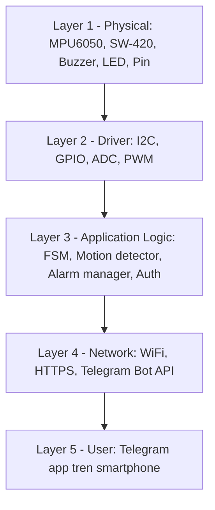
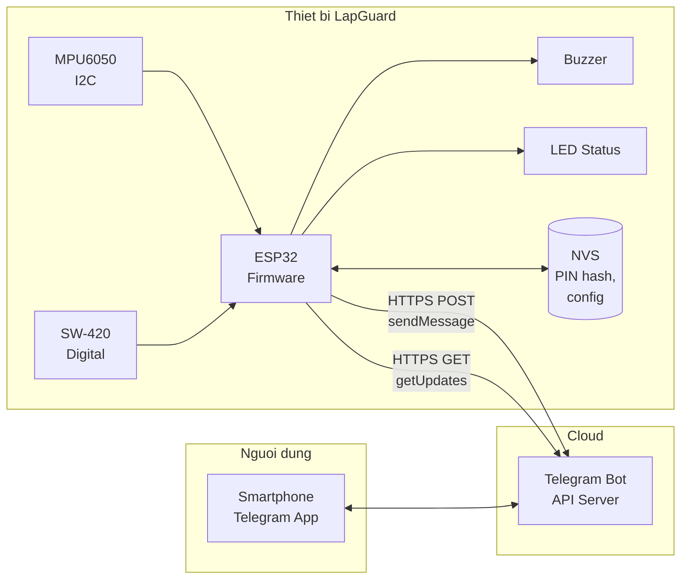
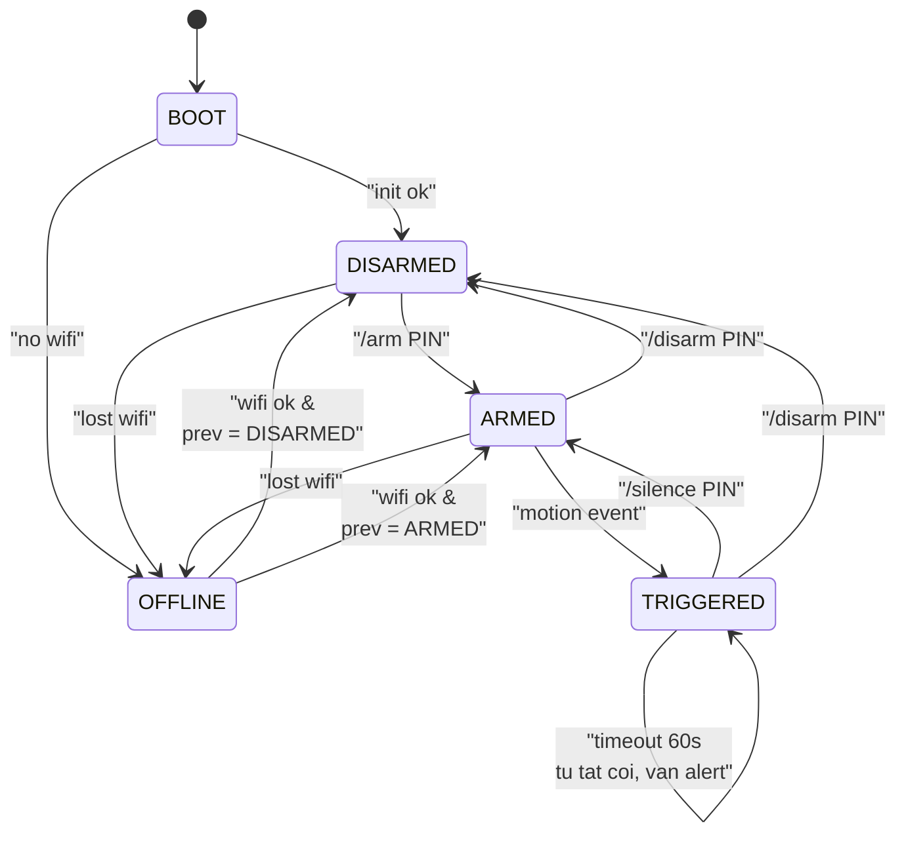
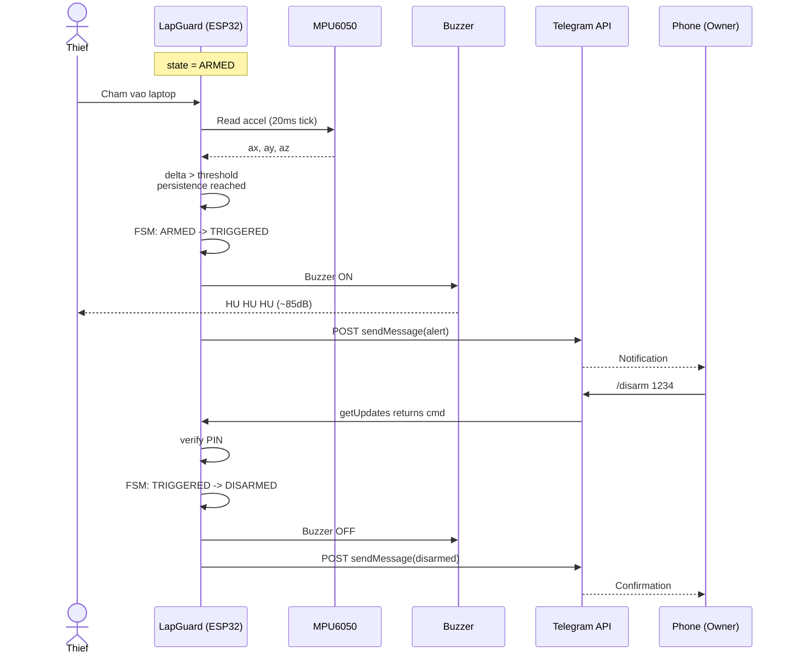
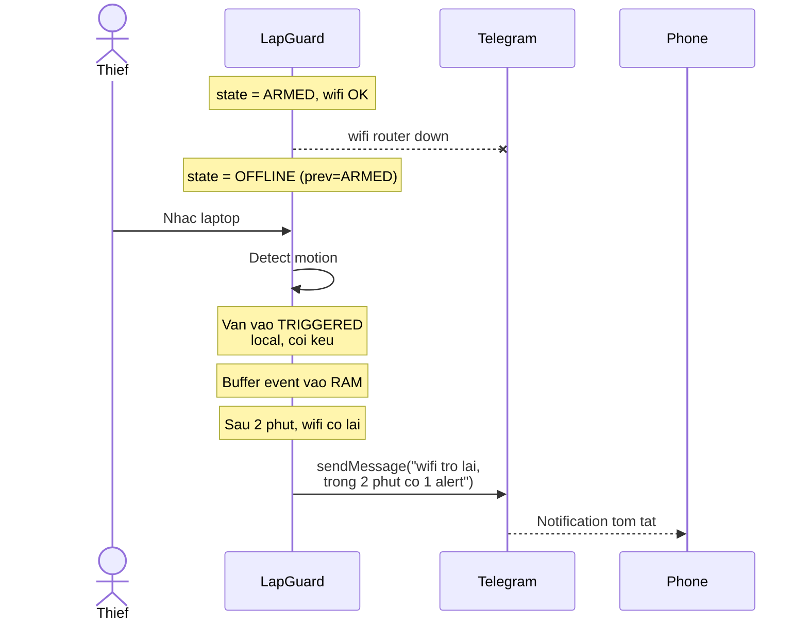

# 03 - Kiến trúc hệ thống

## Mục lục

- [1. Tầng kiến trúc (Layered View)](#1-tầng-kiến-trúc-layered-view)
- [2. Sơ đồ khối tổng thể](#2-sơ-đồ-khối-tổng-thể)
- [3. Luồng dữ liệu (Data Flow)](#3-luồng-dữ-liệu-data-flow)
- [4. Máy trạng thái (Finite State Machine)](#4-máy-trạng-thái-finite-state-machine)
- [5. Bảng chuyển trạng thái](#5-bảng-chuyển-trạng-thái)
- [6. Thuật toán phát hiện chuyển động](#6-thuật-toán-phát-hiện-chuyển-động)
- [7. Mô hình bảo mật](#7-mô-hình-bảo-mật)
- [8. Xử lý lỗi và trường hợp biên](#8-xử-lý-lỗi-và-trường-hợp-biên)
- [9. Timing diagram (sequence)](#9-timing-diagram-sequence)

---

## 1. Tầng kiến trúc (Layered View)

Hệ thống được chia thành 5 tầng, từ vật lý lên người dùng:



Mỗi tầng có trách nhiệm rõ ràng, giảm coupling và dễ test độc lập từng phần.

## 2. Sơ đồ khối tổng thể



Kiến trúc này không cần backend riêng, không cần mở cổng WAN. Telegram đóng vai
trò **message broker** miễn phí và đáng tin cậy.

## 3. Luồng dữ liệu (Data Flow)

### Luồng 1: Đọc cảm biến (mọi thời điểm)

1. Task `SensorTask` chạy chu kỳ 20 ms (50 Hz).
2. Đọc `ax, ay, az` từ MPU6050 qua I2C.
3. Tính `|a| = sqrt(ax^2 + ay^2 + az^2)`.
4. Tính `delta = |a| - 9.81` (trừ trọng lực).
5. Đẩy `delta` vào buffer tròn 10 phần tử để lọc trung bình trượt.
6. Nếu `|delta_avg| > MOTION_THRESHOLD` hoặc SW-420 ngắt -> gọi `motion_event()`.

### Luồng 2: Nhận lệnh Telegram (polling)

1. Task `TelegramTask` chạy chu kỳ 1 s.
2. Gửi `GET https://api.telegram.org/bot<TOKEN>/getUpdates?offset=<last_update_id>`.
3. Parse JSON bằng `ArduinoJson`.
4. Với mỗi update mới:
   - Kiểm tra `chat_id` có trong whitelist không. Nếu không, bỏ qua.
   - Parse lệnh (`/arm`, `/disarm`, `/silence`, `/status`, `/setpin`).
   - Gọi hàm xử lý tương ứng, có thể phát event tới FSM.
5. Cập nhật `last_update_id` để không xử lý lại.

### Luồng 3: Gửi cảnh báo khi TRIGGERED

1. FSM nhận event `MOTION` khi đang ở state `ARMED`.
2. Chuyển sang state `TRIGGERED`, bật còi và LED đỏ.
3. Gọi `telegram_send_alert(delta, timestamp)`.
4. `telegram.cpp` format message và `POST sendMessage` tới API.
5. Nếu mất WiFi, đẩy message vào queue offline (RAM), gửi lại khi có kết nối.

## 4. Máy trạng thái (Finite State Machine)

Đây là trái tim của firmware. Toàn bộ hành vi hệ thống được mô tả bởi FSM này.



Các state và ý nghĩa:

| State | Ý nghĩa | LED xanh | LED đỏ | Buzzer |
|-------|---------|----------|--------|--------|
| BOOT | Khởi tạo phần cứng + WiFi | OFF | OFF | OFF |
| DISARMED | Không giám sát, chờ lệnh | ON (liên tục) | OFF | OFF |
| ARMED | Đang giám sát | Chớp chậm (1 Hz) | OFF | OFF |
| TRIGGERED | Đã phát hiện trộm | OFF | ON (liên tục) | Hú 60s |
| OFFLINE | Mất WiFi | Chớp cam phối 2 LED | Chớp cam phối 2 LED | Tuỳ state con |

## 5. Bảng chuyển trạng thái

| Từ | Sự kiện | Đến | Hành động |
|----|---------|-----|-----------|
| BOOT | `wifi_connected` | DISARMED | gửi "online" tới Telegram |
| BOOT | `wifi_timeout` | OFFLINE | |
| DISARMED | `cmd_arm(PIN)` + PIN đúng | ARMED | gửi "armed" tới Telegram |
| DISARMED | `cmd_arm(PIN)` + PIN sai | DISARMED | tăng counter, nếu >=3 khoá 30s |
| ARMED | `motion_event` | TRIGGERED | bật còi, gửi alert |
| ARMED | `cmd_disarm(PIN)` + đúng | DISARMED | gửi "disarmed" |
| TRIGGERED | `cmd_silence(PIN)` + đúng | ARMED | tắt còi, LED chớp |
| TRIGGERED | `cmd_disarm(PIN)` + đúng | DISARMED | tắt còi, LED xanh |
| TRIGGERED | `timer_60s` | TRIGGERED | tắt còi tự động (chống làm phiền lâu), vẫn ghi nhận motion tiếp nếu có |
| Bất kỳ | `wifi_lost` | OFFLINE | nhớ `prev_state`, vẫn giám sát local |
| OFFLINE | `wifi_connected` | `prev_state` | gửi tin nhắn tóm tắt offline events |

## 6. Thuật toán phát hiện chuyển động

### Cách tiếp cận kết hợp (sensor fusion đơn giản)

Dùng 2 cảm biến song song, OR lại để giảm false negative, kèm bộ lọc để giảm false positive:

```
motion_event = (accel_alert AND persistence_passed) OR vib_alert
```

### Phát hiện qua MPU6050 (chính)

Pseudocode:

```text
loop (chu ky 20ms):
    doc ax, ay, az (g)
    magnitude = sqrt(ax*ax + ay*ay + az*az)
    delta = abs(magnitude - 1.0)   // tru trong luc
    buffer.push(delta)             // ring buffer N=10 mau
    avg = mean(buffer)
    
    if avg > MOTION_THRESHOLD:         // vi du 0.3 g
        consec_count += 1
        if consec_count >= PERSISTENCE:     // vi du 3 chu ky lien tuc
            fire motion_event(avg)
            consec_count = 0
    else:
        consec_count = 0
```

Tham số mặc định:

- `MOTION_THRESHOLD = 0.3 g` (phát hiện nhấc nhẹ, không bắt rung bàn)
- `PERSISTENCE = 3` chu kỳ (~60 ms) -> loại rung ngắn do gõ phím
- `BUFFER_SIZE = 10` -> làm mượt

### Phát hiện qua SW-420 (phụ, nhanh)

- Cấu hình GPIO 14 làm **external interrupt** `FALLING`.
- ISR chỉ set cờ `vib_flag = true` (không làm gì nặng trong ISR).
- Trong loop chính, nếu `vib_flag && state == ARMED` -> phát `motion_event` ngay.
- SW-420 phản ứng < 1 ms, bắt được va chạm nhanh mà MPU6050 có thể miss.

### Debounce báo động

- Sau khi vào TRIGGERED, khoá không nhận thêm motion_event trong 10 giây đầu.
- Lý do: còi đang kêu làm ESP32 rung theo, tránh spam Telegram.

## 7. Mô hình bảo mật

### 7.1 Bảo vệ PIN

- PIN 4-8 chữ số do người dùng chọn qua `/setpin`.
- Không lưu plaintext. Lưu: `hash = SHA256(salt || PIN)` trong NVS.
- `salt` random 16 byte, tạo ra khi thiết bị boot lần đầu, lưu cùng trong NVS.
- So sánh: hash PIN nhập vào với hash đã lưu, dùng **constant-time compare** để tránh timing attack.

### 7.2 Rate-limiting

- Đếm số lần nhập PIN sai liên tiếp.
- Sau 3 lần sai, khoá nhận mọi lệnh Telegram trong 30 giây.
- Trong thời gian khoá, nếu có lệnh mới vẫn phản hồi "tai khoan tam khoa".
- Sau 30 giây, reset counter.

### 7.3 Whitelist chat_id

- Chỉ nhận lệnh từ các `chat_id` trong danh sách cấu hình.
- Chat_id của chủ nhân (hoặc nhóm) được nhập trong `secrets.h`.
- Lệnh từ chat_id lạ bị bỏ qua im lặng, không log ra Telegram để tránh lộ thông tin.

### 7.4 Bảo vệ token bot

- Token bot không commit vào git, để trong `secrets.h` và thêm vào `.gitignore`.
- Nếu lộ token, dùng @BotFather `/revoke` để tạo token mới.

### 7.5 Bảo mật vận chuyển

- Telegram Bot API dùng HTTPS với TLS 1.2.
- ESP32 dùng `WiFiClientSecure` xác thực server certificate qua Telegram root CA đã nhúng sẵn trong thư viện `UniversalTelegramBot`.

## 8. Xử lý lỗi và trường hợp biên

| Tình huống | Giải pháp |
|------------|-----------|
| MPU6050 không phản hồi I2C khi boot | Báo lỗi qua Serial + LED đỏ nhấp nháy SOS, dừng setup, không enter loop |
| WiFi ngắt giữa chừng | Chuyển vào state OFFLINE, log event vào RAM buffer (giới hạn 20 event), tự reconnect 10s/lần |
| Telegram API timeout | Retry 3 lần với backoff (1s, 2s, 4s), nếu vẫn fail thì bỏ qua |
| Pin yếu (< 3.4V) | Gửi cảnh báo "pin yeu, xin sac lai" 1 lần duy nhất |
| Pin cực yếu (< 3.0V) | Lưu state hiện tại vào NVS, shutdown an toàn |
| Heap thấp | Watchdog 30s sẽ reset ESP32 nếu loop không feed, NVS giữ được state ARMED |
| Lũ tin nhắn Telegram | Throttle 1 message/giây, queue tối đa 10 message |
| PIN bị quên | Reset cứng: giữ nút BOOT trên ESP32 + cấp nguồn -> xoá NVS, PIN về mặc định "1234" |

## 9. Timing diagram (sequence)

### Kịch bản trộm điển hình



### Kịch bản mất WiFi khi đang bị trộm


