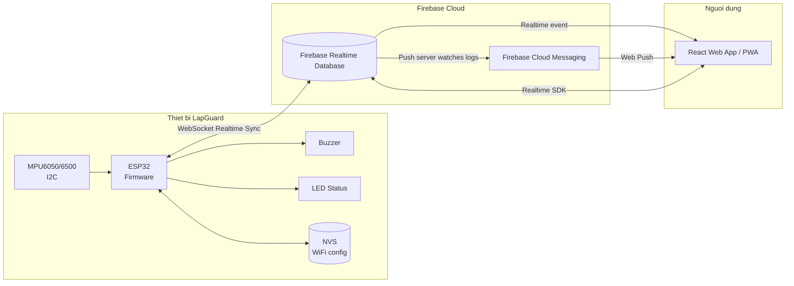
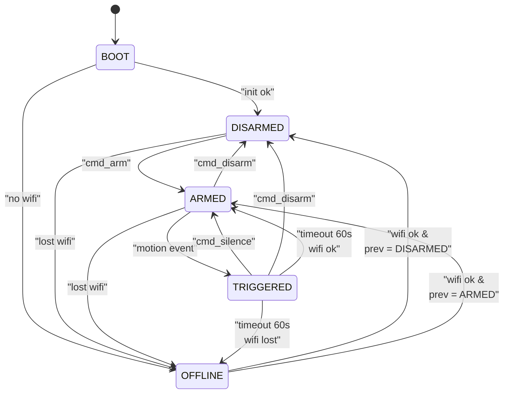
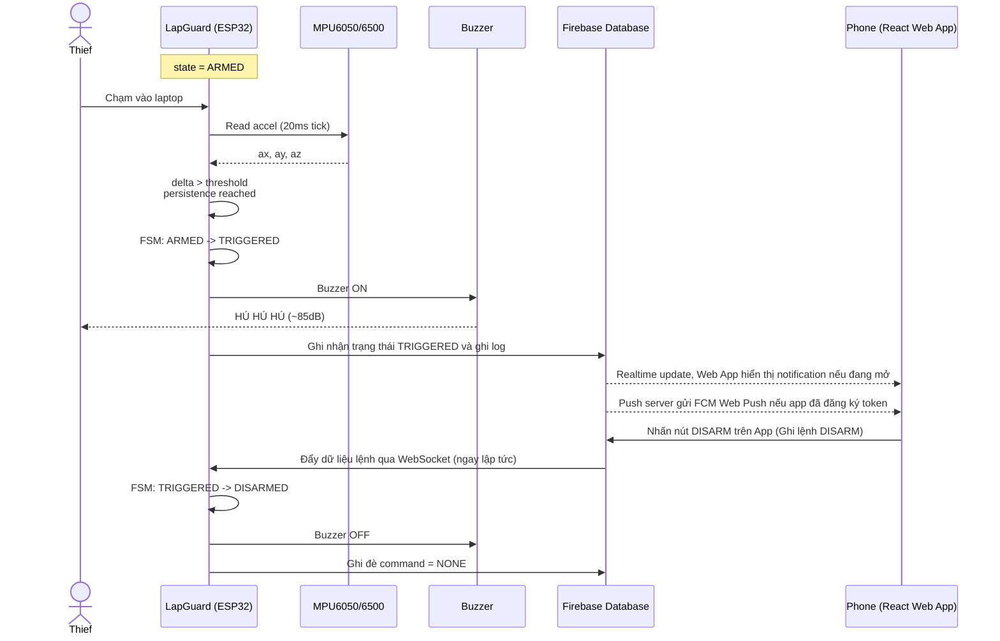
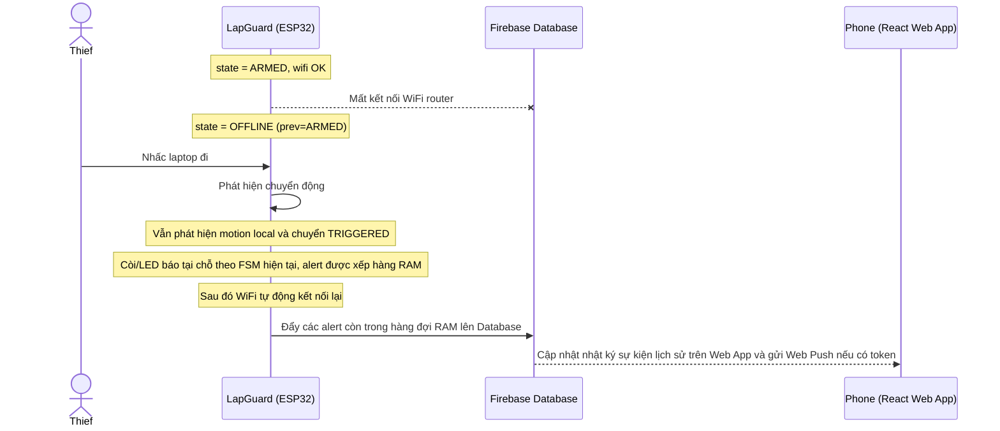

# 03 - Kiến trúc hệ thống

## Mục lục

- [1. Tầng kiến trúc (Layered View)](#1-tầng-kiến-trúc-layered-view)
- [2. Sơ đồ khối tổng thể](#2-sơ-đồ-khối-tổng-thể)
- [3. Luồng dữ liệu (Data Flow)](#3-luồng-dữ-liệu-data-flow)
- [4. Máy trạng thái (Finite State Machine)](#4-máy-trạng-thái-finite-state-machine)
- [5. Bảng chuyển trạng thái](#5-bảng-chuyển-trạng-thái)
- [6. Thuật toán phát hiện chuyển động](#6-thuật-toán-phát-hiện-chuyển-động)
- [7. Mô hình bảo mật](#7-mô-hình-bảo-mật)
- [8. Xử lý lỗi và trường hợp biên](#8-xử-lý-lỗi-và-trường-hợp-biên)
- [9. Timing diagram (sequence)](#9-timing-diagram-sequence)

---

## 1. Tầng kiến trúc (Layered View)

Hệ thống được chia thành 5 tầng, từ vật lý lên người dùng:

```mermaid
flowchart TB
    L1[Layer 1 - Physical: MPU6050, Buzzer, LED, Pin (Cảm biến rung SW-420 làm option bổ sung sau)]
    L2[Layer 2 - Driver: I2C, GPIO, ADC, PWM]
    L3[Layer 3 - Application Logic: FSM, Motion detector, Alarm manager]
    L4[Layer 4 - Network: WiFi, HTTPS, Firebase Realtime Database]
    L5[Layer 5 - User: React Web App / PWA]

    L1 --> L2
    L2 --> L3
    L3 --> L4
    L4 --> L5
```

Mỗi tầng có trách nhiệm rõ ràng, giảm coupling và dễ test độc lập từng phần.

## 2. Sơ đồ khối tổng thể


```mermaid
flowchart LR
    subgraph Device[Thiet bi LapGuard]
        MPU[MPU6050/6500<br/>I2C]
        MCU[ESP32<br/>Firmware]
        BUZZ[Buzzer]
        LED[LED Status]
        NVS[(NVS<br/>WiFi config)]

        MPU --> MCU
        MCU --> BUZZ
        MCU --> LED
        MCU <--> NVS
    end

    subgraph Cloud[Firebase Cloud]
        FB[(Firebase Realtime Database)]
        FCM[Firebase Cloud Messaging]
    end

    subgraph User[Nguoi dung]
        APP[React Web App / PWA]
    end

    MCU <-->|WebSocket Realtime Sync| FB
    APP <-->|Realtime SDK| FB
    FB -->|Realtime event| APP
    FB -->|Push server watches logs| FCM
    FCM -->|Web Push| APP
```

Kiến trúc này sử dụng dịch vụ đám mây Firebase Realtime Database làm trung tâm điều phối trạng thái thời gian thực qua giao thức WebSockets. Người dùng và thiết bị ESP32 đồng bộ dữ liệu song hướng gần như tức thời.

## 3. Luồng dữ liệu (Data Flow)

### Luồng 1: Đọc cảm biến (mọi thời điểm)

1. Vòng `loop()` gọi `motion_poll()` khi hệ thống đang armed; module motion tự giới hạn chu kỳ đọc 20 ms (50 Hz).
2. Đọc `ax, ay, az` từ MPU6050 qua I2C.
3. Tính `|a| = sqrt(ax^2 + ay^2 + az^2)`.
4. Tính `delta = |a| - 9.81` (trừ trọng lực).
5. Đẩy `delta` vào buffer tròn 10 phần tử để lọc trung bình trượt.
6. Nếu `|delta_avg| > MOTION_THRESHOLD` -> gọi `motion_event()`.

### Luồng 2: Nhận lệnh qua Firebase (WebSockets)

1. ESP32 mở kết nối WebSocket ổn định tới Firebase Database khi boot.
2. ESP32 đăng ký lắng nghe sự thay đổi của nút `/devices/<MAC_ADDRESS>/command`.
3. Khi người dùng nhấn nút trên React Web App, App ghi lệnh (`"ARM"`, `"DISARM"`, `"SILENCE"`) vào Firebase.
4. Firebase tự động đẩy (push) thay đổi xuống ESP32.
5. ESP32 nhận lệnh, phát event tương ứng tới FSM (`EVT_CMD_ARM`, `EVT_CMD_DISARM`, `EVT_CMD_SILENCE`).
6. ESP32 thực hiện lệnh và ghi đè giá trị `"NONE"` ngược lại Firebase để hoàn thành.

### Luồng 3: Gửi cảnh báo khi TRIGGERED

1. FSM nhận event `MOTION` khi đang ở state `ARMED`.
2. Chuyển sang state `TRIGGERED`, bật còi và LED đỏ.
3. ESP32 gọi `firebase_send_alert(delta_g)`.
4. Cập nhật status thành `"TRIGGERED"` và ghi sự kiện vào danh sách `/logs` trên Firebase.
5. React Web App đang mở nhận thay đổi realtime và hiển thị toast/native notification của trình duyệt.
6. Push server Node.js lắng nghe `/logs/{logId}` và gửi Web Push qua FCM tới các token đã đăng ký của chủ thiết bị.
7. Nếu mất WiFi, thiết bị lưu tạm tối đa 8 cảnh báo motion vào RAM và đẩy lên Firebase khi có kết nối mạng trở lại.

### Luồng 4: Đồng bộ trạng thái định kỳ

1. `firebase_poll()` chạy trong vòng `loop()` chính, xử lý stream command và hàng đợi ghi Firebase.
2. Đo và cập nhật điện áp pin (`battery_percent`), tín hiệu sóng mạng (`wifi_rssi`) và timestamp (`last_seen`) lên Firebase để người dùng tiện theo dõi.

### 3.4 Thiết kế cây dữ liệu JSON trên Firebase Realtime Database
```json
{
  "users": {
    "$user_uid": {
      "name": "Tên Người Dùng",
      "email": "email@example.com",
      "created_at": 1780722427,
      "devices": {
        "$device_mac": true
      },
      "fcm_tokens": {
        "$token_key": {
          "token": "FCM_WEB_PUSH_TOKEN",
          "user_agent": "Mozilla/5.0 ...",
          "updated_at": 1780725200
        }
      }
    }
  },
  "devices": {
    "$device_mac": {
      "owner_id": "$user_uid",
      "device_name": "LapGuard Laptop của An",
      "status": "DISARMED",
      "command": "NONE",
      "battery_percent": 95,
      "wifi_rssi": -58,
      "last_seen": 1780724998
    }
  },
  "logs": {
    "$log_id": {
      "device_id": "$device_mac",
      "timestamp": 1780725100,
      "event_type": "MOTION_ALERT",
      "detail": "Phát hiện rung lắc mạnh (delta = 2.5g)",
      "resolved": false,
      "push_sent_at": 1780725103,
      "push_success_count": 2,
      "push_failure_count": 0
    }
  }
}
```

Thiết bị hiện được quản lý theo mô hình **1 MAC = 1 owner chính** qua trường
`/devices/<MAC>/owner_id`. Khi người dùng huỷ liên kết thiết bị trên Web App,
ứng dụng xoá `/users/<uid>/devices/<MAC>` và đặt `owner_id = null`, cho phép tài
khoản khác liên kết lại cùng MAC để test hoặc chuyển quyền sử dụng.

Các token Web Push được lưu theo từng tài khoản trong
`/users/<uid>/fcm_tokens`. Push server dùng `owner_id` để tìm đúng tài khoản chủ
thiết bị, đọc danh sách token của tài khoản đó, rồi gửi FCM Web Push tới các
trình duyệt/thiết bị đã đăng ký. Sau khi gửi thành công, push server ghi lại
`push_sent_at`, `push_success_count`, `push_failure_count` vào log để tránh gửi
lặp và hỗ trợ debug.

## 4. Máy trạng thái (Finite State Machine)

Đây là trái tim của firmware. Toàn bộ hành vi hệ thống được mô tả bởi FSM này.


```mermaid
stateDiagram-v2
    [*] --> BOOT
    BOOT --> DISARMED: "init ok"
    BOOT --> OFFLINE: "no wifi"

    DISARMED --> ARMED: "cmd_arm"
    DISARMED --> OFFLINE: "lost wifi"

    ARMED --> TRIGGERED: "motion event"
    ARMED --> DISARMED: "cmd_disarm"
    ARMED --> OFFLINE: "lost wifi"

    TRIGGERED --> ARMED: "cmd_silence"
    TRIGGERED --> DISARMED: "cmd_disarm"
    TRIGGERED --> ARMED: "timeout 60s<br/>wifi ok"
    TRIGGERED --> OFFLINE: "timeout 60s<br/>wifi lost"

    OFFLINE --> DISARMED: "wifi ok &<br/>prev = DISARMED"
    OFFLINE --> ARMED: "wifi ok &<br/>prev = ARMED"
```

Các state và ý nghĩa:

| State | Ý nghĩa | LED xanh | LED đỏ | Buzzer |
|-------|---------|----------|--------|--------|
| BOOT | Khởi tạo phần cứng + WiFi | OFF | OFF | OFF |
| DISARMED | Không giám sát, chờ lệnh | ON (liên tục) | OFF | OFF |
| ARMED | Đang giám sát | Chớp chậm (1 Hz) | OFF | OFF |
| TRIGGERED | Đã phát hiện trộm | OFF | ON (liên tục) | Hú 60s |
| OFFLINE | Mất WiFi | Chớp đồng thời | Chớp đồng thời | OFF |

## 5. Bảng chuyển trạng thái

| Từ | Sự kiện | Đến | Hành động |
|----|---------|-----|-----------|
| BOOT | `wifi_connected` | DISARMED | Cập nhật trạng thái "online" lên Firebase |
| BOOT | `wifi_timeout` | OFFLINE | |
| DISARMED | `cmd_arm` | ARMED | Cập nhật trạng thái "ARMED" lên Firebase |
| ARMED | `motion_event` | TRIGGERED | Bật còi, ghi nhận sự kiện cảnh báo lên Firebase |
| ARMED | `cmd_disarm` | DISARMED | Tắt còi (nếu có), cập nhật trạng thái "DISARMED" lên Firebase |
| TRIGGERED | `cmd_silence` | ARMED | Tắt còi, LED đỏ nháy chậm, cập nhật trạng thái "ARMED" lên Firebase |
| TRIGGERED | `cmd_disarm` | DISARMED | Tắt còi, LED xanh sáng liên tục, cập nhật trạng thái "DISARMED" |
| TRIGGERED | `timer_60s` | ARMED / OFFLINE | Tắt còi tự động sau 60 giây; nếu WiFi còn thì quay lại ARMED, nếu mất WiFi thì chuyển OFFLINE và nhớ `prev_state = ARMED` |
| Bất kỳ | `wifi_lost` | OFFLINE | Nhớ `prev_state`; nếu trước đó là ARMED thì vẫn tiếp tục đọc cảm biến và có thể trigger local |
| OFFLINE | `wifi_connected` | `prev_state` | Tự động thử đồng bộ các cảnh báo motion còn trong hàng đợi RAM lên Firebase |

## 6. Thuật toán phát hiện chuyển động

### Cách tiếp cận hiện tại

Phiên bản hiện tại dùng MPU6050/MPU6500 làm nguồn phát hiện chuyển động chính.
Firmware đọc gia tốc theo chu kỳ 20 ms, tính delta so với trọng lực, rồi đưa
qua bộ lọc trung bình/trì bền để giảm false positive.

```
motion_event = accel_alert AND persistence_passed
```

Cảm biến rung SW-420 được giữ như phương án mở rộng sau. Nếu bổ sung SW-420,
logic dự kiến sẽ chuyển thành:

```
motion_event = (accel_alert AND persistence_passed) OR vib_alert
```

### Phát hiện qua MPU6050 (chính)

Pseudocode:

```text
loop (chu ky 20ms):
    doc ax, ay, az (g)
    magnitude = sqrt(ax*ax + ay*ay + az*az)
    delta = abs(magnitude - 1.0)   // tru trong luc
    buffer.push(delta)             // ring buffer N=10 mau
    avg = mean(buffer)
    
    if avg > MOTION_THRESHOLD:         // vi du 0.3 g
        consec_count += 1
        if consec_count >= PERSISTENCE:     // vi du 3 chu ky lien tuc
            fire motion_event(avg)
            consec_count = 0
    else:
        consec_count = 0
```

Tham số mặc định:

- `MOTION_THRESHOLD = 0.3 g` (phát hiện nhấc nhẹ, không bắt rung bàn)
- `PERSISTENCE = 3` chu kỳ (~60 ms) -> loại rung ngắn do gõ phím
- `BUFFER_SIZE = 10` -> làm mượt

### Phát hiện qua SW-420 (Option v2 - Trì hoãn)
 
- Cấu hình GPIO 14 làm **external interrupt** `FALLING`.
- ISR chỉ set cờ `vib_flag = true` (không làm gì nặng trong ISR).
- Trong loop chính, nếu `vib_flag && state == ARMED` -> phát `motion_event` ngay.
- SW-420 phản ứng < 1 ms, bắt được va chạm nhanh mà MPU6050 có thể miss.
- *Lưu ý: Tính năng này chưa có trong firmware hiện tại; đây là option cho phiên bản sau.*

### Debounce báo động

- Sau khi vào TRIGGERED, khoá không nhận thêm motion_event trong 10 giây đầu.
- Lý do: còi đang kêu làm ESP32 rung theo, tránh spam cảnh báo Firebase.

## 7. Mô hình bảo mật

### 7.1 Bảo mật tài khoản (Firebase Authentication)

- Người dùng bắt buộc phải đăng nhập bằng Email và Mật khẩu được mã hóa và quản lý bởi dịch vụ bảo mật của Firebase.
- Chỉ người dùng đã đăng nhập thành công mới có quyền truy cập vào giao diện quản lý của thiết bị.

### 7.2 Phân quyền dữ liệu (Firebase Realtime Database Rules)

- Để bảo vệ thiết bị khỏi các cuộc tấn công ghi đè lệnh từ người lạ, cơ sở dữ liệu Firebase được thiết lập các quy tắc (Rules) nghiêm ngặt:
  ```json
  {
    "rules": {
      "users": {
        "$uid": {
          ".read": "auth != null && auth.uid === $uid",
          ".write": "auth != null && auth.uid === $uid"
        }
      },
      "devices": {
        "$device_id": {
          ".read": "auth != null && data.child('owner_id').val() === auth.uid",
          ".write": "auth != null && (data.child('owner_id').val() === auth.uid || !data.child('owner_id').exists())"
        }
      },
      "logs": {
        ".indexOn": ["timestamp"],
        "$log_id": {
          ".read": "auth != null",
          ".write": "auth != null"
        }
      }
    }
  }
  ```
- Quy tắc này đảm bảo: người dùng chỉ đọc/ghi dữ liệu tài khoản của chính mình; thiết bị đã có `owner_id` chỉ cho chủ sở hữu thao tác; thiết bị chưa có `owner_id` có thể được liên kết lần đầu hoặc liên kết lại sau khi huỷ liên kết.
- Index `.indexOn: ["timestamp"]` ở `/logs` cần thiết vì push server query log mới theo `timestamp`; nếu thiếu, Firebase vẫn chạy nhưng sẽ cảnh báo và lọc dữ liệu ở client.

### 7.3 Bảo mật secrets và cấu hình dịch vụ

- Cấu hình Firebase cho firmware (`FIREBASE_HOST`, `FIREBASE_AUTH`) và tên thiết bị được lưu trong file [secrets.h](file:///C:/Users/cuphu/OneDrive/M%C3%A1y%20t%C3%ADnh/AIoT/firmware/src/secrets.h). File này được bỏ qua trong `.gitignore` để tránh commit thông tin nhạy cảm lên GitHub.

### 7.4 Bảo mật vận chuyển (HTTPS & WebSockets Secure)

- Giao thức WebSocket và REST API kết nối giữa ESP32 tới Firebase sử dụng SSL/TLS mã hóa trên cổng bảo mật 443 (`wss://` và `https://`), đảm bảo dữ liệu không bị nghe lén trên đường truyền mạng.

## 8. Xử lý lỗi và trường hợp biên

| Tình huống | Giải pháp |
|------------|-----------|
| MPU6050/MPU6500 không phản hồi I2C khi boot | Báo lỗi qua Serial; firmware vẫn chạy các module còn lại nhưng motion detector không trigger |
| WiFi ngắt giữa chừng | Chuyển vào state OFFLINE, nhớ state trước đó; nếu trước đó là ARMED thì vẫn đọc cảm biến, trigger local và lưu tối đa 8 cảnh báo motion trong RAM để đẩy lại khi Firebase stream kết nối lại |
| Firebase API timeout | Tự động thử lại và duy trì kết nối WebSocket chạy ngầm |
| Pin yếu (< 3.4V) | Gửi thông báo đẩy "pin yếu" lên Web App 1 lần duy nhất |
| Pin cực yếu (< 3.0V) | Firmware tính pin về 0%; chưa triển khai shutdown/NVS state tự động |
| Heap thấp | ESP32/Arduino core watchdog vẫn là lớp bảo vệ nền; firmware chưa có health monitor riêng cho heap |
| Quên thông tin WiFi cũ hoặc đổi WiFi mới | Giữ nút BOOT (GPIO0) trong 3 giây sau boot để xoá WiFi đã lưu; ESP32 phát AP `LapGuard_<MAC>` và mở Captive Portal cấu hình WiFi mới |

## 9. Timing diagram (sequence)

### Kịch bản trộm điển hình


```mermaid
sequenceDiagram
    actor T as Thief
    participant L as LapGuard (ESP32)
    participant S as MPU6050/6500
    participant B as Buzzer
    participant FB as Firebase Database
    participant P as Phone (React Web App)

    Note over L: state = ARMED
    T->>L: Chạm vào laptop
    L->>S: Read accel (20ms tick)
    S-->>L: ax, ay, az
    L->>L: delta > threshold<br/>persistence reached
    L->>L: FSM: ARMED -> TRIGGERED
    L->>B: Buzzer ON
    B-->>T: HÚ HÚ HÚ (~85dB)
    L->>FB: Ghi nhận trạng thái TRIGGERED và ghi log
    FB-->>P: Realtime update, Web App hiển thị notification nếu đang mở
    FB-->>P: Push server gửi FCM Web Push nếu app đã đăng ký token
    P->>FB: Nhấn nút DISARM trên App (Ghi lệnh DISARM)
    FB->>L: Đẩy dữ liệu lệnh qua WebSocket (ngay lập tức)
    L->>L: FSM: TRIGGERED -> DISARMED
    L->>B: Buzzer OFF
    L->>FB: Ghi đè command = NONE
```

### Kịch bản mất WiFi khi đang bị trộm


```mermaid
sequenceDiagram
    actor T as Thief
    participant L as LapGuard (ESP32)
    participant FB as Firebase Database
    participant P as Phone (React Web App)

    Note over L: state = ARMED, wifi OK
    L--xFB: Mất kết nối WiFi router
    Note over L: state = OFFLINE (prev=ARMED)
    T->>L: Nhấc laptop đi
    L->>L: Phát hiện chuyển động
    Note over L: Vẫn phát hiện motion local và chuyển TRIGGERED
    Note over L: Còi/LED báo tại chỗ theo FSM hiện tại, alert được xếp hàng RAM
    Note over L: Sau đó WiFi tự động kết nối lại
    L->>FB: Đẩy các alert còn trong hàng đợi RAM lên Database
    FB-->>P: Cập nhật nhật ký sự kiện lịch sử trên Web App và gửi Web Push nếu có token
```
