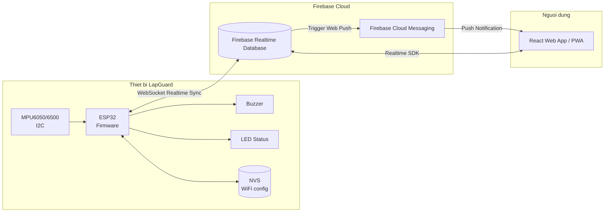
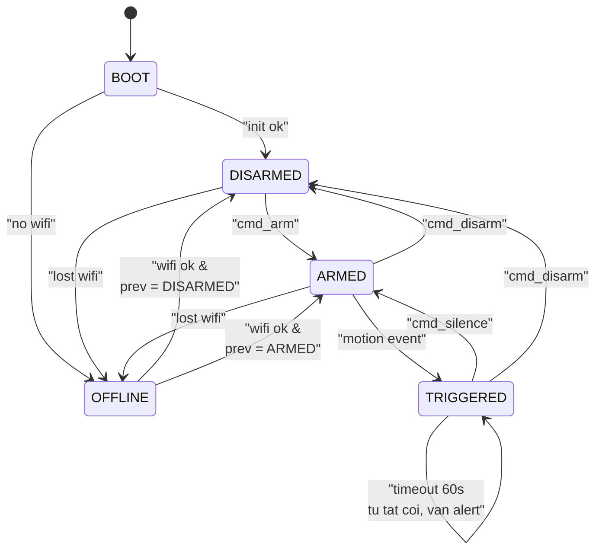
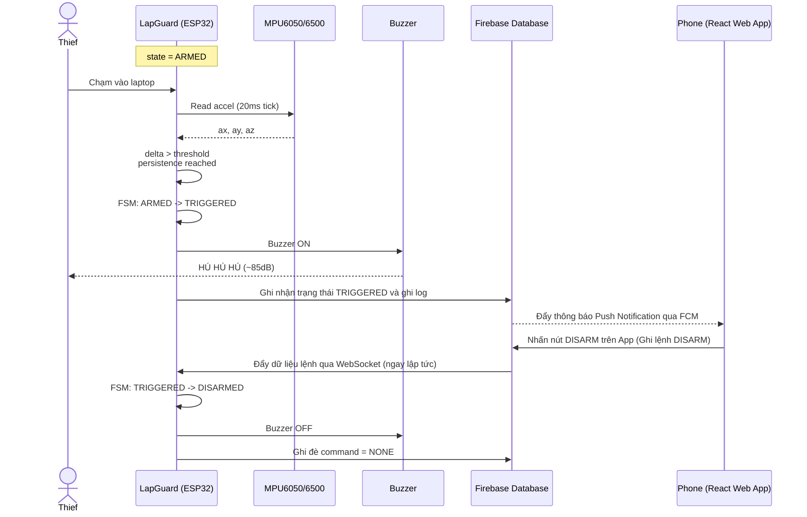
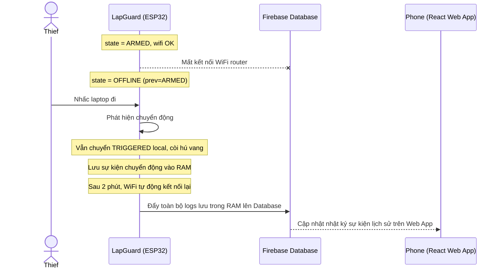

# 03 - Kiến trúc hệ thống

## Mục lục

- [1. Tầng kiến trúc (Layered View)](#1-tầng-kiến-trúc-layered-view)
- [2. Sơ đồ khối tổng thể](#2-sơ-đồ-khối-tổng-thể)
- [3. Luồng dữ liệu (Data Flow)](#3-luồng-dữ-liệu-data-flow)
- [4. Máy trạng thái (Finite State Machine)](#4-máy-trạng-thái-finite-state-machine)
- [5. Bảng chuyển trạng thái](#5-bảng-chuyển-trạng-thái)
- [6. Thuật toán phát hiện chuyển động](#6-thuật-toán-phát-hiện-chuyển-động)
- [7. Mô hình bảo mật](#7-mô-hình-bảo-mật)
- [8. Xử lý lỗi và trường hợp biên](#8-xử-lý-lỗi-và-trường-hợp-biên)
- [9. Timing diagram (sequence)](#9-timing-diagram-sequence)

---

## 1. Tầng kiến trúc (Layered View)

Hệ thống được chia thành 5 tầng, từ vật lý lên người dùng:

```mermaid
flowchart TB
    L1[Layer 1 - Physical: MPU6050, Buzzer, LED, Pin (Cảm biến rung SW-420 làm option bổ sung sau)]
    L2[Layer 2 - Driver: I2C, GPIO, ADC, PWM]
    L3[Layer 3 - Application Logic: FSM, Motion detector, Alarm manager, Auth]
    L4[Layer 4 - Network: WiFi, HTTPS, Telegram Bot API]
    L5[Layer 5 - User: Telegram app tren smartphone]

    L1 --> L2
    L2 --> L3
    L3 --> L4
    L4 --> L5
```

Mỗi tầng có trách nhiệm rõ ràng, giảm coupling và dễ test độc lập từng phần.

## 2. Sơ đồ khối tổng thể


```mermaid
flowchart LR
    subgraph Device[Thiet bi LapGuard]
        MPU[MPU6050/6500<br/>I2C]
        MCU[ESP32<br/>Firmware]
        BUZZ[Buzzer]
        LED[LED Status]
        NVS[(NVS<br/>WiFi config)]

        MPU --> MCU
        MCU --> BUZZ
        MCU --> LED
        MCU <--> NVS
    end

    subgraph Cloud[Firebase Cloud]
        FB[(Firebase Realtime Database)]
        FCM[Firebase Cloud Messaging]
    end

    subgraph User[Nguoi dung]
        APP[React Web App / PWA]
    end

    MCU <-->|WebSocket Realtime Sync| FB
    APP <-->|Realtime SDK| FB
    FB -->|Trigger Web Push| FCM
    FCM -->|Push Notification| APP
```

Kiến trúc này sử dụng dịch vụ đám mây Firebase Realtime Database làm trung tâm điều phối trạng thái thời gian thực qua giao thức WebSockets. Người dùng và thiết bị ESP32 đồng bộ dữ liệu song hướng gần như tức thời.

## 3. Luồng dữ liệu (Data Flow)

### Luồng 1: Đọc cảm biến (mọi thời điểm)

1. Task `SensorTask` chạy chu kỳ 20 ms (50 Hz).
2. Đọc `ax, ay, az` từ MPU6050 qua I2C.
3. Tính `|a| = sqrt(ax^2 + ay^2 + az^2)`.
4. Tính `delta = |a| - 9.81` (trừ trọng lực).
5. Đẩy `delta` vào buffer tròn 10 phần tử để lọc trung bình trượt.
6. Nếu `|delta_avg| > MOTION_THRESHOLD` -> gọi `motion_event()`.

### Luồng 2: Nhận lệnh qua Firebase (WebSockets)

1. ESP32 mở kết nối WebSocket ổn định tới Firebase Database khi boot.
2. ESP32 đăng ký lắng nghe sự thay đổi của nút `/devices/<MAC_ADDRESS>/command`.
3. Khi người dùng nhấn nút trên React Web App, App ghi lệnh (`"ARM"`, `"DISARM"`, `"SILENCE"`) vào Firebase.
4. Firebase tự động đẩy (push) thay đổi xuống ESP32.
5. ESP32 nhận lệnh, phát event tương ứng tới FSM (`EVT_CMD_ARM`, `EVT_CMD_DISARM`, `EVT_CMD_SILENCE`).
6. ESP32 thực hiện lệnh và ghi đè giá trị `"NONE"` ngược lại Firebase để hoàn thành.

### Luồng 3: Gửi cảnh báo khi TRIGGERED

1. FSM nhận event `MOTION` khi đang ở state `ARMED`.
2. Chuyển sang state `TRIGGERED`, bật còi và LED đỏ.
3. ESP32 gọi `firebase_send_alert(delta_g)`.
4. Cập nhật status thành `"TRIGGERED"` và ghi sự kiện vào danh sách `/logs` trên Firebase.
5. Firebase Database Trigger sẽ gọi Firebase Cloud Messaging (FCM) để gửi thông báo đẩy (Web Push) đến trình duyệt/điện thoại người dùng.
6. Nếu mất WiFi, thiết bị lưu tạm sự kiện vào RAM và đẩy lên Firebase đồng bộ khi có kết nối mạng trở lại.

### Luồng 4: Đồng bộ trạng thái định kỳ

1. Thiết bị ESP32 chạy một Task nền `FirebaseTask` định kỳ (ví dụ mỗi 10 giây).
2. Đo và cập nhật điện áp pin (`battery_percent`), tín hiệu sóng mạng (`wifi_rssi`) và timestamp (`last_seen`) lên Firebase để người dùng tiện theo dõi.

### 3.4 Thiết kế cây dữ liệu JSON trên Firebase Realtime Database
```json
{
  "users": {
    "$user_uid": {
      "name": "Tên Người Dùng",
      "email": "email@example.com",
      "created_at": 1780722427,
      "devices": {
        "$device_mac": true
      }
    }
  },
  "devices": {
    "$device_mac": {
      "owner_id": "$user_uid",
      "device_name": "LapGuard Laptop của An",
      "status": "DISARMED",
      "command": "NONE",
      "battery_percent": 95,
      "wifi_rssi": -58,
      "last_seen": 1780724998
    }
  },
  "logs": {
    "$log_id": {
      "device_id": "$device_mac",
      "timestamp": 1780725100,
      "event_type": "MOTION_ALERT",
      "detail": "Phát hiện rung lắc mạnh (delta = 2.5g)",
      "resolved": false
    }
  }
}
```

## 4. Máy trạng thái (Finite State Machine)

Đây là trái tim của firmware. Toàn bộ hành vi hệ thống được mô tả bởi FSM này.


```mermaid
stateDiagram-v2
    [*] --> BOOT
    BOOT --> DISARMED: "init ok"
    BOOT --> OFFLINE: "no wifi"

    DISARMED --> ARMED: "cmd_arm"
    DISARMED --> OFFLINE: "lost wifi"

    ARMED --> TRIGGERED: "motion event"
    ARMED --> DISARMED: "cmd_disarm"
    ARMED --> OFFLINE: "lost wifi"

    TRIGGERED --> ARMED: "cmd_silence"
    TRIGGERED --> DISARMED: "cmd_disarm"
    TRIGGERED --> TRIGGERED: "timeout 60s<br/>tu tat coi, van alert"

    OFFLINE --> DISARMED: "wifi ok &<br/>prev = DISARMED"
    OFFLINE --> ARMED: "wifi ok &<br/>prev = ARMED"
```

Các state và ý nghĩa:

| State | Ý nghĩa | LED xanh | LED đỏ | Buzzer |
|-------|---------|----------|--------|--------|
| BOOT | Khởi tạo phần cứng + WiFi | OFF | OFF | OFF |
| DISARMED | Không giám sát, chờ lệnh | ON (liên tục) | OFF | OFF |
| ARMED | Đang giám sát | Chớp chậm (1 Hz) | OFF | OFF |
| TRIGGERED | Đã phát hiện trộm | OFF | ON (liên tục) | Hú 60s |
| OFFLINE | Mất WiFi | Chớp cam phối 2 LED | Chớp cam phối 2 LED | Tuỳ state con |

## 5. Bảng chuyển trạng thái

| Từ | Sự kiện | Đến | Hành động |
|----|---------|-----|-----------|
| BOOT | `wifi_connected` | DISARMED | Cập nhật trạng thái "online" lên Firebase |
| BOOT | `wifi_timeout` | OFFLINE | |
| DISARMED | `cmd_arm` | ARMED | Cập nhật trạng thái "ARMED" lên Firebase |
| ARMED | `motion_event` | TRIGGERED | Bật còi, ghi nhận sự kiện cảnh báo lên Firebase |
| ARMED | `cmd_disarm` | DISARMED | Tắt còi (nếu có), cập nhật trạng thái "DISARMED" lên Firebase |
| TRIGGERED | `cmd_silence` | ARMED | Tắt còi, LED đỏ nháy chậm, cập nhật trạng thái "ARMED" lên Firebase |
| TRIGGERED | `cmd_disarm` | DISARMED | Tắt còi, LED xanh sáng liên tục, cập nhật trạng thái "DISARMED" |
| TRIGGERED | `timer_60s` | TRIGGERED | Tắt còi tự động (chống tiếng ồn lâu), giữ nguyên trạng thái giám sát |
| Bất kỳ | `wifi_lost` | OFFLINE | Nhớ `prev_state`, vẫn tiếp tục giám sát và báo động tại chỗ |
| OFFLINE | `wifi_connected` | `prev_state` | Tự động đồng bộ và đẩy toàn bộ sự kiện lịch sử offline lên Firebase |

## 6. Thuật toán phát hiện chuyển động

### Cách tiếp cận kết hợp (sensor fusion đơn giản)

Dùng 2 cảm biến song song, OR lại để giảm false negative, kèm bộ lọc để giảm false positive:

```
motion_event = (accel_alert AND persistence_passed) OR vib_alert
```

### Phát hiện qua MPU6050 (chính)

Pseudocode:

```text
loop (chu ky 20ms):
    doc ax, ay, az (g)
    magnitude = sqrt(ax*ax + ay*ay + az*az)
    delta = abs(magnitude - 1.0)   // tru trong luc
    buffer.push(delta)             // ring buffer N=10 mau
    avg = mean(buffer)
    
    if avg > MOTION_THRESHOLD:         // vi du 0.3 g
        consec_count += 1
        if consec_count >= PERSISTENCE:     // vi du 3 chu ky lien tuc
            fire motion_event(avg)
            consec_count = 0
    else:
        consec_count = 0
```

Tham số mặc định:

- `MOTION_THRESHOLD = 0.3 g` (phát hiện nhấc nhẹ, không bắt rung bàn)
- `PERSISTENCE = 3` chu kỳ (~60 ms) -> loại rung ngắn do gõ phím
- `BUFFER_SIZE = 10` -> làm mượt

### Phát hiện qua SW-420 (Option v2 - Trì hoãn)
 
- Cấu hình GPIO 14 làm **external interrupt** `FALLING`.
- ISR chỉ set cờ `vib_flag = true` (không làm gì nặng trong ISR).
- Trong loop chính, nếu `vib_flag && state == ARMED` -> phát `motion_event` ngay.
- SW-420 phản ứng < 1 ms, bắt được va chạm nhanh mà MPU6050 có thể miss.
- *Lưu ý: Tính năng này đã được trì hoãn để triển khai ở các phiên bản sau nhằm tối ưu hóa chi phí và đơn giản hóa phần cứng prototype.*

### Debounce báo động

- Sau khi vào TRIGGERED, khoá không nhận thêm motion_event trong 10 giây đầu.
- Lý do: còi đang kêu làm ESP32 rung theo, tránh spam Telegram.

## 7. Mô hình bảo mật

### 7.1 Bảo mật tài khoản (Firebase Authentication)

- Người dùng bắt buộc phải đăng nhập bằng Email và Mật khẩu được mã hóa và quản lý bởi dịch vụ bảo mật của Firebase.
- Chỉ người dùng đã đăng nhập thành công mới có quyền truy cập vào giao diện quản lý của thiết bị.

### 7.2 Phân quyền dữ liệu (Firebase Realtime Database Rules)

- Để bảo vệ thiết bị khỏi các cuộc tấn công ghi đè lệnh từ người lạ, cơ sở dữ liệu Firebase được thiết lập các quy tắc (Rules) nghiêm ngặt:
  ```json
  {
    "rules": {
      "devices": {
        "$device_id": {
          ".read": "auth != null && data.child('owner_id').val() === auth.uid",
          ".write": "auth != null && data.child('owner_id').val() === auth.uid"
        }
      }
    }
  }
  ```
- Quy tắc này đảm bảo: Chỉ có người dùng là chủ sở hữu thiết bị (`owner_id` khớp với Firebase `auth.uid`) mới có quyền xem trạng thái và ghi lệnh (`command`) điều khiển thiết bị đó.

### 7.3 Bảo mật API Keys và cấu hình dịch vụ

- Các khóa API của Firebase (API Key, Database URL, Storage Bucket) được lưu trữ trong file cấu hình [secrets.h](file:///C:/Users/cuphu/OneDrive/M%C3%A1y%20t%C3%ADnh/AIoT/firmware/src/secrets.h) và được bỏ qua không commit lên GitHub qua `.gitignore`.

### 7.4 Bảo mật vận chuyển (HTTPS & WebSockets Secure)

- Giao thức WebSocket và REST API kết nối giữa ESP32 tới Firebase sử dụng SSL/TLS mã hóa trên cổng bảo mật 443 (`wss://` và `https://`), đảm bảo dữ liệu không bị nghe lén trên đường truyền mạng.

## 8. Xử lý lỗi và trường hợp biên

| Tình huống | Giải pháp |
|------------|-----------|
| MPU6050/MPU6500 không phản hồi I2C khi boot | Báo lỗi qua Serial + LED đỏ nhấp nháy SOS, dừng setup, không enter loop |
| WiFi ngắt giữa chừng | Chuyển vào state OFFLINE, lưu các sự kiện chuyển động vào RAM buffer (giới hạn 20), tự động thử kết nối lại mỗi 10 giây |
| Firebase API timeout | Tự động thử lại và duy trì kết nối WebSocket chạy ngầm |
| Pin yếu (< 3.4V) | Gửi thông báo đẩy "pin yếu" lên Web App 1 lần duy nhất |
| Pin cực yếu (< 3.0V) | Lưu state hiện tại vào NVS, shutdown an toàn |
| Heap thấp | Watchdog 30s sẽ reset ESP32 nếu loop không feed, NVS giữ được trạng thái kết nối cũ |
| Quên thông tin WiFi cũ hoặc đổi WiFi mới | ESP32 phát WiFi `LapGuard_AP` và tự động mở Captive Portal cấu hình WiFi mới |

## 9. Timing diagram (sequence)

### Kịch bản trộm điển hình


```mermaid
sequenceDiagram
    actor T as Thief
    participant L as LapGuard (ESP32)
    participant S as MPU6050/6500
    participant B as Buzzer
    participant FB as Firebase Database
    participant P as Phone (React Web App)

    Note over L: state = ARMED
    T->>L: Chạm vào laptop
    L->>S: Read accel (20ms tick)
    S-->>L: ax, ay, az
    L->>L: delta > threshold<br/>persistence reached
    L->>L: FSM: ARMED -> TRIGGERED
    L->>B: Buzzer ON
    B-->>T: HÚ HÚ HÚ (~85dB)
    L->>FB: Ghi nhận trạng thái TRIGGERED và ghi log
    FB-->>P: Đẩy thông báo Push Notification qua FCM
    P->>FB: Nhấn nút DISARM trên App (Ghi lệnh DISARM)
    FB->>L: Đẩy dữ liệu lệnh qua WebSocket (ngay lập tức)
    L->>L: FSM: TRIGGERED -> DISARMED
    L->>B: Buzzer OFF
    L->>FB: Ghi đè command = NONE
```

### Kịch bản mất WiFi khi đang bị trộm


```mermaid
sequenceDiagram
    actor T as Thief
    participant L as LapGuard (ESP32)
    participant FB as Firebase Database
    participant P as Phone (React Web App)

    Note over L: state = ARMED, wifi OK
    L--xFB: Mất kết nối WiFi router
    Note over L: state = OFFLINE (prev=ARMED)
    T->>L: Nhấc laptop đi
    L->>L: Phát hiện chuyển động
    Note over L: Vẫn chuyển TRIGGERED local, còi hú vang
    Note over L: Lưu sự kiện chuyển động vào RAM
    Note over L: Sau 2 phút, WiFi tự động kết nối lại
    L->>FB: Đẩy toàn bộ logs lưu trong RAM lên Database
    FB-->>P: Cập nhật nhật ký sự kiện lịch sử trên Web App
```
