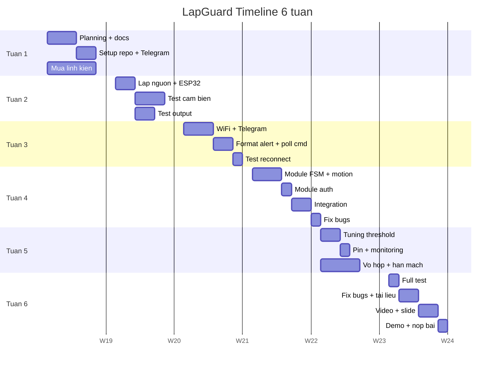

# 06 - Tiến độ và chi phí

## Mục lục

- [1. Timeline tổng thể 6 tuần](#1-timeline-tổng-thể-6-tuần)
- [2. Chi tiết công việc từng tuần](#2-chi-tiết-công-việc-từng-tuần)
- [3. Biểu đồ Gantt](#3-biểu-đồ-gantt)
- [4. Phân công nhóm](#4-phân-công-nhóm)
- [5. Cột mốc (Milestones)](#5-cột-mốc-milestones)
- [6. Bảng chi phí chi tiết](#6-bảng-chi-phí-chi-tiết)
- [7. Ngân sách dự phòng](#7-ngân-sách-dự-phòng)
- [8. Deliverables cuối kỳ](#8-deliverables-cuối-kỳ)

---

## 1. Timeline tổng thể 6 tuần

Dự án được chia thành **6 tuần**, phù hợp với 1 học kỳ ngắn hoặc nửa học kỳ dài (ngoài thời
gian học lý thuyết). Mỗi tuần có mục tiêu cụ thể và deliverable rõ ràng.

| Tuần | Chủ đề | Deliverable chính |
|------|--------|-------------------|
| 1 | Khởi động & mua linh kiện | Repo git, tài liệu planning, đơn linh kiện |
| 2 | Prototype phần cứng | Mạch breadboard đọc được cảm biến + blink LED |
| 3 | Tích hợp mạng | Gửi được tin nhắn Telegram test từ ESP32 |
| 4 | Hoàn thiện logic | FSM + PIN + tất cả lệnh hoạt động |
| 5 | Tinh chỉnh & đóng gói | Vỏ hộp + tuning threshold + pin |
| 6 | Kiểm thử & trình bày | Video demo + báo cáo + slide + thuyết trình thử |

## 2. Chi tiết công việc từng tuần

### Tuần 1 - Khởi động

**Mục tiêu**: Hoàn thiện planning, setup repo, đặt hàng linh kiện.

| Task | Thời gian | Người phụ trách | Trạng thái |
|------|-----------|-----------------|------------|
| Lập tài liệu 7 file markdown ở `docs/` | 2-3 ngày | Cả nhóm | To do |
| Tạo GitHub repo, thiết lập `.gitignore`, branch `main` | 0.5 ngày | Leader | To do |
| Đặt mua linh kiện theo BOM | 0.5 ngày (shipping 3-5 ngày) | HW lead | To do |
| Cài VSCode + PlatformIO trên máy từng thành viên | 1 ngày | Cả nhóm | To do |
| Tạo Telegram bot với BotFather và lấy chat_id | 0.5 ngày | Dev | To do |

**Cuối tuần 1**: có đủ tài liệu, repo đã setup, linh kiện đang trên đường về.

### Tuần 2 - Prototype phần cứng

**Mục tiêu**: Lắp mạch xong trên breadboard, đọc được các cảm biến.

| Task | Thời gian | Người phụ trách |
|------|-----------|-----------------|
| Nhận linh kiện, kiểm tra đủ và hoạt động | 0.5 ngày | HW lead |
| Lắp khối nguồn (TP4056 + MT3608), chỉnh 5V | 0.5 ngày | HW lead |
| Lắp ESP32 + test blink LED | 0.5 ngày | HW lead |
| Viết sketch test I2C scanner, xác nhận MPU6050 | 0.5 ngày | Dev |
| Viết sketch đọc gia tốc, in ra Serial | 1 ngày | Dev |
| Viết sketch test SW-420 interrupt | 0.5 ngày | Dev |
| Viết sketch test buzzer + LED trạng thái | 0.5 ngày | Dev |

**Cuối tuần 2**: mọi cảm biến và output đã được test độc lập.

### Tuần 3 - Tích hợp mạng

**Mục tiêu**: ESP32 kết nối WiFi và Telegram thành công.

| Task | Thời gian | Người phụ trách |
|------|-----------|-----------------|
| Implement `wifi_mgr` module + reconnect logic | 1 ngày | Dev |
| Tích hợp `UniversalTelegramBot`, gửi tin nhắn hello world | 0.5 ngày | Dev |
| Implement `tg_poll()` - nhận lệnh `/start`, `/ping` | 1 ngày | Dev |
| Implement format tin nhắn alert có emoji và timestamp | 0.5 ngày | Dev |
| Test mất WiFi và reconnect tự động | 0.5 ngày | Dev + Tester |
| Viết file `secrets.example.h` + update `.gitignore` | 0.5 ngày | Dev |

**Cuối tuần 3**: gõ lệnh vào Telegram -> ESP32 nhận và phản hồi được.

### Tuần 4 - Hoàn thiện logic

**Mục tiêu**: Tất cả lệnh, FSM, PIN hoạt động đúng spec.

| Task | Thời gian | Người phụ trách |
|------|-----------|-----------------|
| Implement module `fsm` đầy đủ với tất cả transitions | 1 ngày | Dev |
| Implement module `motion` với buffer + persistence | 1 ngày | Dev |
| Implement module `auth` với SHA256 + NVS | 1 ngày | Dev |
| Tích hợp tất cả vào `main.cpp` với FreeRTOS task | 1 ngày | Dev |
| Test end-to-end tất cả lệnh | 0.5 ngày | Tester |
| Fix bug đợt 1 | 0.5 ngày | Dev |

**Cuối tuần 4**: firmware v1.0 đạt tất cả FR "Must".

### Tuần 5 - Tinh chỉnh & đóng gói

**Mục tiêu**: Hoàn thiện tuning, vỏ hộp, và tính năng pin.

| Task | Thời gian | Người phụ trách |
|------|-----------|-----------------|
| Tuning `MOTION_THRESHOLD` qua nhiều test case thực tế | 1 ngày | Tester + Dev |
| Implement đo pin và cảnh báo pin yếu | 0.5 ngày | Dev |
| Test thời lượng pin liên tục | 0.5 ngày (chạy nền) | Tester |
| Chuyển từ breadboard sang perfboard có hàn | 1 ngày | HW lead |
| Khoan lỗ, lắp vào vỏ hộp | 1 ngày | HW lead |
| In nhãn dán tên nhóm / logo | 0.5 ngày | Docs |

**Cuối tuần 5**: thiết bị hoàn thiện dạng sản phẩm, pin dùng được ít nhất 8h.

### Tuần 6 - Kiểm thử & trình bày

**Mục tiêu**: Sẵn sàng demo và bàn giao.

| Task | Thời gian | Người phụ trách |
|------|-----------|-----------------|
| Chạy đầy đủ test suite (9 test case ở `07-testing-and-risks.md`) | 1 ngày | Tester |
| Fix bug đợt 2 | 0.5 ngày | Dev |
| Viết báo cáo Word / PDF (10-15 trang) | 1.5 ngày | Docs |
| Làm slide PowerPoint (15-20 slide) | 0.5 ngày | Docs |
| Quay video demo 60-120s (có lồng tiếng) | 1 ngày | Cả nhóm |
| Tập thuyết trình 2-3 lần | 0.5 ngày | Cả nhóm |
| Nộp bài + demo chính thức | 0.5 ngày | Cả nhóm |

**Cuối tuần 6**: nộp bài hoàn chỉnh, demo thành công.

## 3. Biểu đồ Gantt



> Lưu ý: các ngày cụ thể là **placeholder**, cập nhật theo lịch thực tế của nhóm.

## 4. Phân công nhóm

Giả định nhóm 4 người. Nếu nhóm ít/nhiều hơn, phân bổ lại công việc.

| Vai trò | Phụ trách chính | Thời gian ước tính |
|---------|-----------------|---------------------|
| **Leader** | Điều phối, quản lý tiến độ, họp weekly, tổng hợp tài liệu | ~20h |
| **Firmware Dev** | Viết code ESP32, implement module, debug | ~40h |
| **Hardware Lead** | Mua linh kiện, lắp mạch, hàn, làm vỏ | ~25h |
| **Tester / Docs** | Test cases, video demo, báo cáo, slide | ~25h |

Mọi thành viên đều cần hiểu cơ bản hệ thống để trả lời câu hỏi của giảng viên.

### Meeting schedule

- **Daily standup**: 15 phút mỗi ngày (tuỳ chọn, nhất là tuần 4-6).
- **Weekly sync**: 1 giờ vào chủ nhật, review tuần cũ + plan tuần mới.
- **Mid-term check**: cuối tuần 3, đảm bảo khớp milestone M2.

## 5. Cột mốc (Milestones)

| ID | Mốc | Deadline | Tiêu chí đạt |
|----|-----|----------|---------------|
| M0 | Planning xong | Cuối tuần 1 | 7 file markdown trong `docs/` đã merge vào main |
| M1 | HW Prototype ok | Cuối tuần 2 | Video ngắn cho thấy đọc được cảm biến + còi kêu |
| M2 | Kết nối Telegram ok | Cuối tuần 3 | Gõ `/ping` -> bot trả về `pong` |
| M3 | Firmware v1.0 | Cuối tuần 4 | Tất cả FR "Must" pass, demo được 3 kịch bản sử dụng |
| M4 | Sản phẩm hoàn thiện | Cuối tuần 5 | Thiết bị đóng hộp, pin 8h+ |
| M5 | Bàn giao | Cuối tuần 6 | Video + slide + báo cáo + demo trực tiếp |

## 6. Bảng chi phí chi tiết

### 6.1 Linh kiện chính

| # | Linh kiện | SL | Đơn giá (VND) | Thành tiền |
|---|-----------|----|---------------|------------|
| 1 | ESP32 DevKit V1 | 1 | 120.000 | 120.000 |
| 2 | MPU6050 module | 1 | 25.000 | 25.000 |
| 3 | SW-420 vibration sensor | 1 | 15.000 | 15.000 |
| 4 | Active buzzer module | 1 | 10.000 | 10.000 |
| 5 | LED 5mm xanh + đỏ | 2 | 2.500 | 5.000 |
| 6 | Pin 18650 2500mAh | 1 | 45.000 | 45.000 |
| 7 | Holder pin 18650 | 1 | 10.000 | 10.000 |
| 8 | Module TP4056 USB-C | 1 | 20.000 | 20.000 |
| 9 | Module MT3608 boost | 1 | 15.000 | 15.000 |
| 10 | Công tắc SS12D00 | 1 | 3.000 | 3.000 |
| 11 | Breadboard 400 lỗ | 1 | 25.000 | 25.000 |
| 12 | Jumper Dupont | 40 | 400 | 16.000 |
| 13 | Hộp nhựa / in 3D | 1 | 30.000 | 30.000 |
| 14 | Velcro + băng keo | 1 | 10.000 | 10.000 |
| | **Tổng linh kiện** | | | **349.000** |

### 6.2 Chi phí phụ trợ

| Hạng mục | Thành tiền |
|----------|------------|
| Phí ship linh kiện | 25.000 |
| Pin dự phòng (nếu cháy) | 45.000 |
| Dây cáp USB (nếu thiếu) | 20.000 |
| In báo cáo màu | 30.000 |
| In / ép plastic slide thuyết trình | 20.000 |
| **Tổng phụ trợ** | **140.000** |

### 6.3 Tổng ngân sách

```text
Linh kien chinh:     349.000 VND
Chi phi phu tro:     140.000 VND
--------
Tong:                489.000 VND
Du phong 10%:         49.000 VND
=========
Ngan sach de xuat:   540.000 VND
```

Chia cho nhóm 4 người: **~135.000 VND / người**.

## 7. Ngân sách dự phòng

Các rủi ro tài chính có thể xảy ra:

| Rủi ro | Chi phí phát sinh | Biện pháp |
|--------|-------------------|-----------|
| Cháy ESP32 do đấu nhầm cực | +120.000 VND | Test kỹ nguồn trước khi cắm, luôn có 1 board dự phòng |
| Hỏng pin 18650 | +45.000 VND | Không sạc quá mức, tắt công tắc khi không dùng |
| Hỏng MPU6050 do tĩnh điện | +25.000 VND | Nối đất khi thao tác |
| Hỏng breadboard | +25.000 VND | Dự phòng sẵn 1 bộ |

Tổng dự phòng linh kiện: **~215.000 VND**. Nằm trong ngân sách 10% dự phòng ở trên.

## 8. Deliverables cuối kỳ

Danh sách sản phẩm bàn giao khi kết thúc dự án:

### 8.1 Tài liệu

- [ ] `README.md` + 7 file trong `docs/` (đã có ở dự án này).
- [ ] Báo cáo chính thức `.pdf` 10-15 trang (tổng hợp từ markdown).
- [ ] Slide PowerPoint `.pptx` 15-20 slide.

### 8.2 Mã nguồn

- [ ] Repo GitHub public (hoặc private share với giảng viên).
- [ ] Branch `main` ổn định, có tag `v1.0`.
- [ ] `secrets.example.h` có trong repo, `secrets.h` ignore.
- [ ] `README` trong `firmware/` hướng dẫn build.

### 8.3 Phần cứng

- [ ] 1 thiết bị LapGuard hoàn chỉnh, đóng hộp, dán nhãn.
- [ ] Bộ pin 18650 đã sạc đầy.
- [ ] Cáp USB-C để sạc.

### 8.4 Media

- [ ] Video demo YouTube hoặc Drive (60-120s).
- [ ] Ảnh sản phẩm high-res (ít nhất 5 góc).
- [ ] Screenshot Telegram khi có alert.

### 8.5 Trình bày

- [ ] Thuyết trình 8-10 phút trước lớp + giảng viên.
- [ ] Demo trực tiếp (đã test trước).
- [ ] Sẵn sàng trả lời Q&A về kiến trúc, code, phần cứng.

## 9. Log tiến độ thực tế

> Cập nhật nhanh theo trạng thái hiện tại của repo để dễ theo dõi khi làm việc nhóm không ngồi chung.

- **2026-05-31**: Đã khởi tạo `firmware/` bằng PlatformIO cho board `esp32dev` với framework Arduino.
- **2026-05-31**: Đã dựng firmware scaffold gồm `config`, `alarm`, `auth`, `fsm`, `motion`, `net`, `power` và build PASS trên Windows.
- **2026-05-31**: Telegram bot đã có các lệnh nền tảng `/arm`, `/disarm`, `/silence`, `/setpin`, `/reboot`, `/status`.
- **2026-05-31**: MPU6050 đã được nối vào vòng đọc mẫu và FSM/alarm đã có phản hồi LED/buzzer ở mức prototype.
- **2026-05-31**: `auth` đã nâng lên SHA-256 + salt, lưu trong `Preferences`, và build vẫn PASS.
- **2026-05-31**: Bước tiếp theo là nạp thử lên board thật, kiểm tra Serial Monitor, cảm biến và luồng Telegram end-to-end.

## 10. Checkpoint tiến độ theo tuần

> Quy ước: ✅ = đã xong trên repo hiện tại, ⬜ = chưa làm xong hoặc chưa kiểm tra được khi chưa có board.

### Tuần 1

- ✅ Hoàn thành bộ tài liệu 7 file markdown trong `docs/`
- ⬜ Tạo GitHub repo public / thống nhất nhánh `main`
- ⬜ Tạo Telegram bot thật bằng BotFather và lấy `chat_id` chính thức
- ⬜ Cài VSCode + PlatformIO trên toàn bộ máy thành viên

### Tuần 2

- ⬜ Lắp khối nguồn TP4056 + MT3608 trên board thật
- ⬜ Test ESP32 + blink LED trên mạch thật
- ⬜ Test MPU6050 / SW-420 / buzzer / LED bằng phần cứng

### Tuần 3

- ✅ Dựng `wifi_mgr` với reconnect logic
- ✅ Tích hợp `UniversalTelegramBot` và command scaffold
- ✅ Viết `secrets.example.h` và ignore `secrets.h`
- ⬜ Test reconnect WiFi và nhận lệnh Telegram trên board thật

### Tuần 4

- ✅ Dựng `fsm` transitions cơ bản
- ✅ Dựng `motion` buffer + persistence
- ✅ Dựng `auth` SHA-256 + salt + `Preferences`
- ⬜ Tích hợp FreeRTOS tasks / chạy end-to-end trên board thật
- ⬜ Test toàn bộ lệnh `/arm`, `/disarm`, `/silence`, `/setpin`, `/reboot`, `/status` bằng hardware

### Tuần 5

- ✅ Dựng module battery và cảnh báo pin yếu
- ⬜ Tuning threshold bằng dữ liệu thực tế
- ⬜ Chuyển sang perfboard / đóng hộp

### Tuần 6

- ⬜ Chạy full test suite trên thiết bị thật
- ⬜ Viết báo cáo / slide / video demo
- ⬜ Demo trực tiếp và chốt bàn giao
