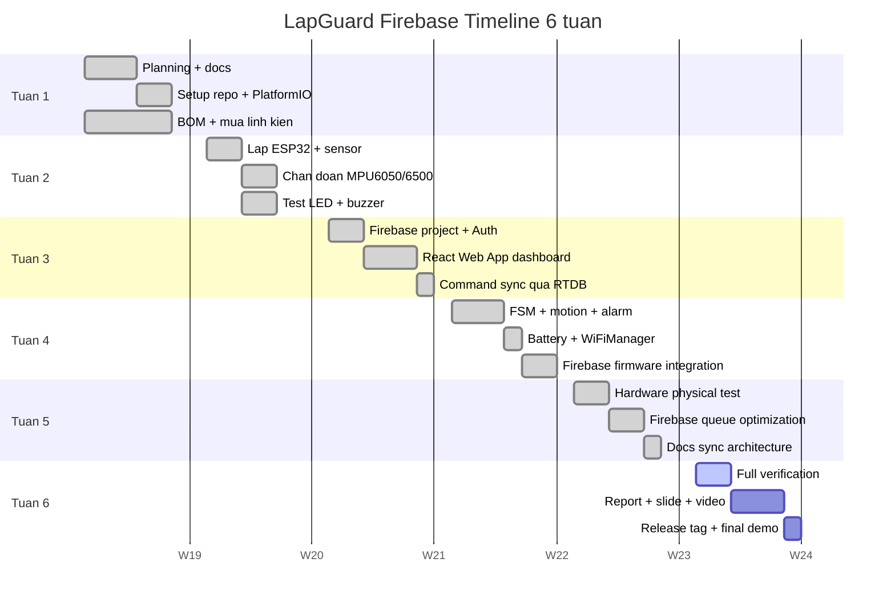

# 06 - Tiến độ, checklist và chi phí

## Mục lục

- [1. Timeline tổng thể 6 tuần](#1-timeline-tổng-thể-6-tuần)
- [2. Checklist theo tuần](#2-checklist-theo-tuần)
- [3. Biểu đồ Gantt](#3-biểu-đồ-gantt)
- [4. Milestones](#4-milestones)
- [5. Checklist còn lại trước khi chốt demo](#5-checklist-còn-lại-trước-khi-chốt-demo)
- [6. Changelog phát sinh ngoài checklist](#6-changelog-phát-sinh-ngoài-checklist)
- [7. Chi phí](#7-chi-phí)
- [8. Deliverables cuối kỳ](#8-deliverables-cuối-kỳ)

---

## 1. Timeline tổng thể 6 tuần

Timeline hiện tại đã được cập nhật theo kiến trúc mới: **ESP32 + Firebase Realtime Database + React Web App/PWA**. Các mục Telegram cũ không còn là hướng triển khai chính.

| Tuần | Chủ đề | Deliverable chính | Trạng thái |
|------|--------|-------------------|------------|
| 1 | Khởi động & planning | Repo, docs nền, BOM, kiến trúc Firebase | ✅ Xong |
| 2 | Prototype phần cứng | ESP32 đọc được MPU6050/MPU6500, LED/còi hoạt động | ✅ Xong |
| 3 | Cloud & Web App | Firebase project, Auth, Realtime Database, React Web App | ✅ Xong bản prototype |
| 4 | Firmware core | FSM, motion filter, alarm, battery, Firebase command/status/log | ✅ Xong bản hiện tại |
| 5 | Tối ưu phản hồi & phần cứng thật | Queue Firebase, offline alert queue, test vật lý, cập nhật sơ đồ nối dây | ✅ Xong bản hiện tại |
| 6 | Kiểm thử & bàn giao | Build/test pass, docs khớp kiến trúc, chuẩn bị báo cáo/demo | ⬜ Đang hoàn thiện |

## 2. Checklist theo tuần

Quy ước:

- ✅ Đã hoàn thành hoặc đã xác minh trong repo/thiết bị thật.
- ⬜ Chưa làm hoặc chưa có bằng chứng xác minh đủ chắc.
- 🟡 Đã có prototype nhưng còn cần siết lại trước demo cuối.

### Tuần 1 - Planning & Repo

- ✅ Tạo cấu trúc repo gồm `firmware/`, `web-app/`, `docs/`.
- ✅ Viết bộ tài liệu nền trong `docs/`.
- ✅ Tạo `.gitignore`, bỏ qua `secrets.h`, `.pio/`, build artifact.
- ✅ Xác định kiến trúc mới: Firebase Realtime Database + React Web App/PWA.
- ✅ Tạo `secrets.example.h` cho firmware.
- ⬜ Chốt Firebase Rules production theo mô hình owner/pairing.

### Tuần 2 - Prototype phần cứng

- ✅ Nối ESP32 với MPU6050/MPU6500 qua I2C: SDA GPIO21, SCL GPIO22.
- ✅ Xác định module cảm biến thực tế có thể là MPU6500 (`WHO_AM_I=0x70`).
- ✅ Firmware hỗ trợ cả MPU6050 (`0x68`) và MPU6500 (`0x70`).
- ✅ Test sensor diagnostic, in `ax/ay/az`, `delta`, `average`, gyro và lỗi đọc.
- ✅ Nối LED xanh GPIO26, LED đỏ GPIO27, còi GPIO25.
- ✅ Thiết bị vật lý đã test và hoạt động ổn ở mức prototype.
- ✅ Đồng bộ sơ đồ nối dây MPU INT về GPIO13 trong docs.

### Tuần 3 - Firebase & Web App

- ✅ Tạo React Web App dùng Firebase Auth và Realtime Database.
- ✅ Web App có đăng ký/đăng nhập email/password.
- ✅ Web App có quản lý thiết bị theo MAC address.
- ✅ Web App gửi lệnh `ARM`, `DISARM`, `SILENCE` qua `/devices/<MAC>/command`.
- ✅ Web App đọc trạng thái, pin, RSSI, `last_seen` realtime.
- ✅ Web App hiển thị log cảnh báo từ `/logs`.
- ✅ Có notification local của browser khi Web App đang mở và thiết bị chuyển `TRIGGERED`.
- 🟡 FCM Web Push thật khi app đóng chưa triển khai, đang để là hướng nâng cấp sau.

### Tuần 4 - Firmware core

- ✅ `motion` đọc MPU qua driver I2C nội bộ, lấy mẫu 50 Hz.
- ✅ `MotionFilter` dùng buffer 10 mẫu, threshold `0.30 g`, persistence 3 mẫu.
- ✅ `fsm` có các state: `Boot`, `Disarmed`, `Armed`, `Triggered`, `Offline`.
- ✅ `alarm` điều khiển LED/còi theo state và timeout còi.
- ✅ `battery` đọc ADC GPIO34 và tính phần trăm pin.
- ✅ `wifi_mgr` dùng WiFiManager captive portal và reset WiFi bằng nút BOOT.
- ✅ `firebase_mgr` lắng nghe command từ Firebase stream.
- ✅ Firmware build pass với `esp32dev`.
- ✅ Native unit test cho `MotionFilter` pass.
- ⬜ Chưa tách thành FreeRTOS task riêng; hiện dùng Arduino `loop()` + queue nhẹ.

### Tuần 5 - Tối ưu phản hồi ESP32 -> Firebase

- ✅ Đưa `firebase_poll()` xuống sau motion polling để ưu tiên cảm biến/còi.
- ✅ `firebase_update_status()` không ghi mạng trực tiếp từ FSM nữa, chỉ queue status.
- ✅ `firebase_send_alert()` không ghi mạng trực tiếp trong nhánh motion nữa, chỉ queue alert.
- ✅ Thêm hàng đợi RAM tối đa 8 motion alert để gửi lại khi Firebase sẵn sàng.
- ✅ Ưu tiên đẩy `status=TRIGGERED` trước alert log để Web App nhận cảnh báo nhanh hơn.
- ✅ Dọn cấu hình Telegram cũ khỏi `config.h`.
- ✅ Web App `npm run lint` pass.
- ✅ Web App `npm run build` pass.
- ✅ Docs kiến trúc cập nhật lại theo Firebase, không còn mô tả Telegram là luồng chính.

### Tuần 6 - Kiểm thử & bàn giao

- ✅ `platformio run -e esp32dev` pass.
- ✅ `platformio test -e native` pass.
- ✅ `npm run lint` pass.
- ✅ `npm run build` pass.
- 🟡 Bundle web-app đang lớn hơn 500 kB sau minify; chưa chặn demo nhưng nên tối ưu nếu còn thời gian.
- ⬜ Chạy full manual test theo `docs/07-testing-and-risks.md` và ghi kết quả vào `docs/test-report.md`.
- ⬜ Chụp ảnh/video demo cuối cùng theo kiến trúc Firebase.
- ⬜ Chuẩn bị slide và báo cáo nộp cuối kỳ.
- ⬜ Tạo tag release `v1.0` sau khi chốt test vật lý cuối.

## 3. Biểu đồ Gantt


```mermaid
gantt
    title LapGuard Firebase Timeline 6 tuan
    dateFormat  YYYY-MM-DD
    axisFormat  W%V

    section Tuan 1
    Planning + docs               :done, a1, 2026-05-04, 3d
    Setup repo + PlatformIO       :done, a2, after a1, 2d
    BOM + mua linh kien           :done, a3, 2026-05-04, 5d

    section Tuan 2
    Lap ESP32 + sensor            :done, b1, 2026-05-11, 2d
    Chan doan MPU6050/6500        :done, b2, after b1, 2d
    Test LED + buzzer             :done, b3, after b1, 2d

    section Tuan 3
    Firebase project + Auth       :done, c1, 2026-05-18, 2d
    React Web App dashboard       :done, c2, after c1, 3d
    Command sync qua RTDB         :done, c3, after c2, 1d

    section Tuan 4
    FSM + motion + alarm          :done, d1, 2026-05-25, 3d
    Battery + WiFiManager         :done, d2, after d1, 1d
    Firebase firmware integration :done, d3, after d2, 2d

    section Tuan 5
    Hardware physical test        :done, e1, 2026-06-01, 2d
    Firebase queue optimization   :done, e2, after e1, 2d
    Docs sync architecture        :done, e3, after e2, 1d

    section Tuan 6
    Full verification             :active, f1, 2026-06-08, 2d
    Report + slide + video        :f2, after f1, 3d
    Release tag + final demo      :f3, after f2, 1d
```

> Ngày trong Gantt là mốc kế hoạch tương đối. Trạng thái thực tế được theo dõi bằng checklist ở trên.

## 4. Milestones

| ID | Mốc | Tiêu chí đạt | Trạng thái |
|----|-----|--------------|------------|
| M0 | Planning xong | Repo + docs nền + BOM + hướng kiến trúc | ✅ |
| M1 | Hardware prototype ok | ESP32 đọc cảm biến, LED/còi hoạt động | ✅ |
| M2 | Firebase/Web App prototype | Login, add device, gửi command qua RTDB | ✅ |
| M3 | Firmware v1 | FSM, motion, alarm, battery, WiFiManager, Firebase stream | ✅ |
| M4 | Tối ưu độ trễ cloud | Motion không gọi Firebase trực tiếp, có queue alert/status | ✅ |
| M5 | Verification | Firmware build/test pass, web build/lint pass | ✅ |
| M6 | Bàn giao cuối | Full manual test, video, slide, report, tag `v1.0` | ⬜ |

## 5. Checklist còn lại trước khi chốt demo

### Bắt buộc

- ⬜ Chạy manual test end-to-end trên thiết bị thật:
  - ARM từ Web App.
  - Lắc/nhấc laptop để vào `TRIGGERED`.
  - Còi/LED phản hồi ngay.
  - Web App nhận status/log.
  - DISARM/SILENCE từ Web App.
- ⬜ Test mất WiFi khi đang armed:
  - Thiết bị vào `OFFLINE`.
  - Vẫn phát hiện motion local.
  - Khi WiFi lại, alert trong RAM được đẩy lên Firebase.
- ⬜ Ghi kết quả test vào `docs/test-report.md`.
- ⬜ Chốt Firebase Rules đủ dùng cho demo, tối thiểu không để database public hoàn toàn nếu trình bày bảo mật.
- ⬜ Tạo tag `v1.0` sau khi test cuối pass.

### Nên làm nếu còn thời gian

- ⬜ Tối ưu bundle web-app hoặc tách code-splitting để bỏ warning > 500 kB.
- ⬜ Viết hướng dẫn deploy web-app lên Firebase Hosting/Vercel.
- ⬜ Thêm ảnh/screenshot Web App vào báo cáo.
- ⬜ Ghi rõ giới hạn: notification hiện hoạt động tốt khi Web App đang mở; FCM push khi app đóng là hướng nâng cấp sau.

### Hướng nâng cấp sau demo

- ⬜ Pairing bằng mã claim thay vì chỉ nhập MAC address.
- ⬜ Firebase Cloud Functions + FCM Web Push thật.
- ⬜ FreeRTOS tasks riêng cho sensor/network/FSM nếu cần độ trễ ổn định hơn.
- ⬜ OTA firmware update.

## 6. Changelog phát sinh ngoài checklist

Các thay đổi này phát sinh trong quá trình debug/thử phần cứng, không có trong kế hoạch ban đầu:

- ✅ Phát hiện module bán là MPU6050 nhưng thực tế có thể là MPU6500; firmware đã hỗ trợ cả hai.
- ✅ Thêm `docs/problem.md` để ghi lại quá trình chẩn đoán lỗi cảm biến không nhận.
- ✅ Thêm sensor diagnostics build (`esp32dev-sensor-test`) để đọc raw accel/gyro và kiểm tra độ nhạy.
- ✅ Chuyển kiến trúc cloud từ Telegram Bot sang Firebase Realtime Database + React Web App.
- ✅ Thêm WiFiManager captive portal để cấu hình WiFi không cần hardcode SSID/password.
- ✅ Thêm reset WiFi bằng nút BOOT trong cửa sổ 3 giây sau khởi động.
- ✅ Thêm NTP sync sau khi WiFi kết nối.
- ✅ Dọn web-app để `npm run lint` pass.
- ✅ Cập nhật docs để không mô tả sai rằng FCM/Web Push thật đã hoàn thành.
- ✅ Cập nhật sơ đồ nối dây LED/còi và thống nhất MPU INT là GPIO13.
- ✅ Tách Firebase write khỏi FSM/motion bằng hàng đợi status/alert trong firmware.

## 7. Chi phí

### 7.1 Linh kiện chính

| # | Linh kiện | SL | Đơn giá (VND) | Thành tiền |
|---|-----------|----|---------------|------------|
| 1 | ESP32 DevKit V1 | 1 | 120.000 | 120.000 |
| 2 | MPU6050/GY-521 module | 1 | 25.000 | 25.000 |
| 3 | Active buzzer module | 1 | 10.000 | 10.000 |
| 4 | LED 5mm xanh + đỏ | 2 | 2.500 | 5.000 |
| 5 | Pin 18650 2500mAh | 1 | 45.000 | 45.000 |
| 6 | Holder pin 18650 | 1 | 10.000 | 10.000 |
| 7 | Module TP4056 USB-C | 1 | 20.000 | 20.000 |
| 8 | Module MT3608 boost | 1 | 15.000 | 15.000 |
| 9 | Công tắc SS12D00 | 1 | 3.000 | 3.000 |
| 10 | Breadboard 400 lỗ | 1 | 25.000 | 25.000 |
| 11 | Jumper Dupont | 40 | 400 | 16.000 |
| 12 | Hộp nhựa / in 3D | 1 | 30.000 | 30.000 |
| 13 | Velcro + băng keo | 1 | 10.000 | 10.000 |
| | **Tổng linh kiện** | | | **334.000** |

### 7.2 Chi phí phụ trợ

| Hạng mục | Thành tiền |
|----------|------------|
| Phí ship linh kiện | 25.000 |
| Pin dự phòng nếu hỏng | 45.000 |
| Dây cáp USB nếu thiếu | 20.000 |
| In báo cáo màu | 30.000 |
| In / ép plastic slide thuyết trình | 20.000 |
| **Tổng phụ trợ** | **140.000** |

### 7.3 Tổng ngân sách

```text
Linh kien chinh:     334.000 VND
Chi phi phu tro:     140.000 VND
--------
Tong:                474.000 VND
Du phong 10%:         47.000 VND
=========
Ngan sach de xuat:   521.000 VND
```

## 8. Deliverables cuối kỳ

### 8.1 Mã nguồn

- ✅ Firmware PlatformIO build được cho `esp32dev`.
- ✅ Web App React build được bằng Vite.
- ✅ Native test cho core motion filter pass.
- ✅ `secrets.example.h` có trong repo, `secrets.h` không commit.
- ⬜ Tag release `v1.0`.

### 8.2 Tài liệu

- ✅ `README.md` và docs nền.
- ✅ Sơ đồ nối dây phần cứng.
- ✅ Report chẩn đoán cảm biến trong `docs/problem.md`.
- ✅ Timeline/checklist cập nhật theo Firebase.
- ⬜ `docs/test-report.md` sau full manual test.
- ⬜ Báo cáo PDF cuối kỳ.
- ⬜ Slide thuyết trình.

### 8.3 Demo

- ✅ Thiết bị vật lý prototype đã test ổn.
- ✅ Web App nhận/trả lệnh với Firebase ở mức prototype.
- ⬜ Video demo cuối cùng.
- ⬜ Ảnh sản phẩm và screenshot Web App.
- ⬜ Demo trực tiếp trước giảng viên.
