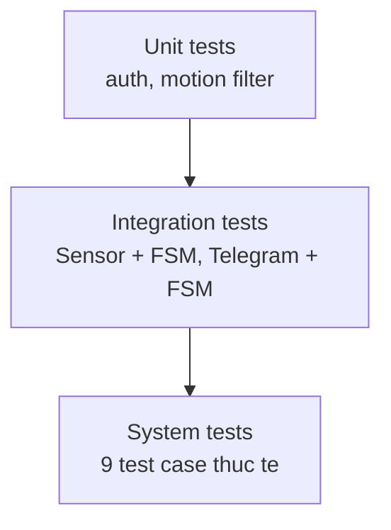
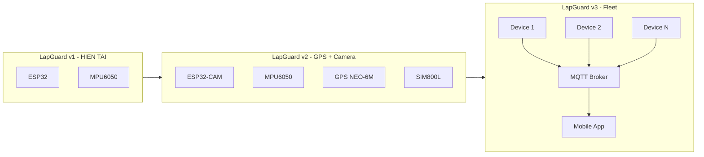

# 07 - Kiểm thử và rủi ro

## Mục lục

- [1. Chiến lược kiểm thử](#1-chiến-lược-kiểm-thử)
- [2. Kiểm thử đơn vị (Unit Test)](#2-kiểm-thử-đơn-vị-unit-test)
- [3. Kiểm thử tích hợp (Integration Test)](#3-kiểm-thử-tích-hợp-integration-test)
- [4. Kiểm thử hệ thống (System / Acceptance Test)](#4-kiểm-thử-hệ-thống-system--acceptance-test)
- [5. Kiểm thử phi chức năng](#5-kiểm-thử-phi-chức-năng)
- [6. Báo cáo kết quả test](#6-báo-cáo-kết-quả-test)
- [7. Ma trận rủi ro](#7-ma-trận-rủi-ro)
- [8. Giới hạn hiện tại](#8-giới-hạn-hiện-tại)
- [9. Hướng mở rộng](#9-hướng-mở-rộng)

---

## 1. Chiến lược kiểm thử

Dự án áp dụng **test pyramid** gọn nhẹ gồm 3 lớp:



- **Unit test**: cho logic thuần (auth, motion filter) - chạy native trên máy tính, không cần ESP32.
- **Integration test**: nối cảm biến thật, test 2 module ghép với nhau.
- **System / Acceptance test**: test end-to-end toàn bộ thiết bị trong điều kiện thực.

Công cụ:

- **PlatformIO native test**: chạy unit test C++ trên máy tính bằng `pio test -e native`.
- **Manual test checklist**: cho integration và system.

## 2. Kiểm thử đơn vị (Unit Test)

### UT-01: auth_verify_pin với PIN đúng

```cpp
TEST_CASE("verify PIN dung") {
    auth_init();
    auth_set_pin("1234");
    REQUIRE(auth_verify_pin("1234") == true);
}
```

### UT-02: auth_verify_pin với PIN sai

```cpp
TEST_CASE("verify PIN sai") {
    auth_init();
    auth_set_pin("1234");
    REQUIRE(auth_verify_pin("9999") == false);
}
```

### UT-03: auth lockout sau 3 lần sai

```cpp
TEST_CASE("lockout sau 3 lan sai") {
    auth_init();
    auth_set_pin("1234");
    auth_verify_pin("0000");
    auth_verify_pin("0000");
    auth_verify_pin("0000");
    REQUIRE(auth_is_locked() == true);
}
```

### UT-04: motion filter không trigger khi dưới threshold

```cpp
TEST_CASE("motion filter - khong trigger") {
    motion_reset_buffer();
    for (int i = 0; i < 10; ++i) motion_push_sample(0.1f);
    REQUIRE(motion_check() == false);
}
```

### UT-05: motion filter trigger khi vượt threshold liên tục

```cpp
TEST_CASE("motion filter - trigger") {
    motion_reset_buffer();
    for (int i = 0; i < 3; ++i) motion_push_sample(0.5f);
    REQUIRE(motion_check() == true);
}
```

### UT-06: PIN mới phải 4-8 chữ số

```cpp
TEST_CASE("PIN validation") {
    REQUIRE(auth_is_valid_pin("123") == false);        // quá ngắn
    REQUIRE(auth_is_valid_pin("1234") == true);
    REQUIRE(auth_is_valid_pin("12345678") == true);
    REQUIRE(auth_is_valid_pin("123456789") == false);  // quá dài
    REQUIRE(auth_is_valid_pin("abcd") == false);       // không phải số
}
```

## 3. Kiểm thử tích hợp (Integration Test)

### IT-01: MPU6050 -> motion module -> event queue

Mục tiêu: xác nhận sự kiện chuyển động thật sự được phát đi đúng.

- Setup: ESP32 + MPU6050 nối đúng sơ đồ, nạp firmware test chỉ in ra Serial.
- Thao tác: rung thiết bị 5 lần.
- Kỳ vọng: Serial in ra 5 dòng `[MOTION] delta=x.xg`.
- Pass criteria: đúng 5 event, không thiếu không thừa.

### IT-02: Lệnh Telegram -> FSM transition

Mục tiêu: lệnh từ Telegram thực sự chuyển state.

- Setup: ESP32 đã kết nối WiFi, bot hoạt động.
- Thao tác: từ Telegram gõ `/arm 1234`, `/disarm 1234`, `/arm 1234`, `/silence 1234`, `/disarm 1234`.
- Kỳ vọng: Serial log chuyển state theo đúng thứ tự: `DISARMED -> ARMED -> DISARMED -> ARMED -> ARMED -> DISARMED`.

### IT-03: Offline queue khi mất WiFi

Mục tiêu: sự kiện xảy ra lúc offline được gửi lại khi online.

- Setup: thiết bị ở `ARMED`, WiFi đang hoạt động.
- Thao tác:
  1. Tắt WiFi router.
  2. Rung cảm biến 2 lần cách nhau 20s.
  3. Bật lại WiFi router.
- Kỳ vọng: Telegram nhận được 1 tin nhắn tóm tắt liệt kê 2 sự kiện với timestamp chính xác.

## 4. Kiểm thử hệ thống (System / Acceptance Test)

Đây là các test case dùng để **đánh giá nghiệm thu** trước khi nộp bài. Mỗi test case viết theo format Given / When / Then.

### TC-01: Không báo động khi DISARMED và rung mạnh

- **Given**: state = DISARMED.
- **When**: nhấc thiết bị lên 30 cm và đặt xuống mạnh.
- **Then**: không có tiếng còi, không có tin nhắn Telegram, LED xanh vẫn sáng.

### TC-02: Không báo động giả khi ARMED và rung nhẹ

- **Given**: state = ARMED, thiết bị để yên trên bàn.
- **When**: gõ ngón tay lên bàn cách thiết bị 10 cm trong 10 giây.
- **Then**: không có còi, không có tin nhắn.

### TC-03: Báo động khi ARMED và bị nhấc

- **Given**: state = ARMED.
- **When**: nhấc thiết bị lên khoảng 10 cm.
- **Then**:
  - Còi kêu trong <200 ms.
  - Telegram nhận tin nhắn trong <3s.
  - LED đỏ sáng.
  - State chuyển sang TRIGGERED.

### TC-04: Tắt còi với `/disarm` PIN đúng

- **Given**: state = TRIGGERED, còi đang kêu.
- **When**: gõ `/disarm 1234` từ Telegram.
- **Then**: còi tắt ngay trong 1s, LED đỏ tắt, LED xanh sáng, bot phản hồi "DISARMED", state = DISARMED.

### TC-05: Khoá 30s sau 3 lần sai PIN

- **Given**: state bất kỳ.
- **When**: gõ `/disarm 9999` liên tiếp 3 lần.
- **Then**:
  - Lần 1: "PIN sai, còn 2 lần".
  - Lần 2: "PIN sai, còn 1 lần".
  - Lần 3: "Khoá 30s do sai PIN 3 lần".
  - Gõ lệnh tiếp trong 30s: "Tạm khoá, thử lại sau X giây".
  - Sau 30s: counter reset, chấp nhận lệnh bình thường.

### TC-06: Hoạt động tại chỗ khi mất WiFi

- **Given**: state = ARMED, WiFi hoạt động.
- **When**: tắt WiFi router, sau đó rung thiết bị.
- **Then**:
  - LED chuyển chế độ chớp cam.
  - Còi vẫn kêu khi rung.
  - State chuyển TRIGGERED local.

### TC-07: Reconnect và flush event sau offline

- **Given**: vừa hoàn thành TC-06.
- **When**: bật lại WiFi router.
- **Then**:
  - Trong 30s, LED trở lại chế độ bình thường.
  - Telegram nhận được tóm tắt các event đã xảy ra.

### TC-08: Cảnh báo pin yếu

- **Given**: pin dưới 3.4V.
- **When**: chu kỳ đo pin 60s kích hoạt.
- **Then**: Telegram nhận tin nhắn "Pin yếu, xin sạc lại", chỉ 1 lần duy nhất mỗi chu kỳ sạc.

### TC-09: Thời lượng pin liên tục

- **Given**: pin mới sạc đầy.
- **When**: để thiết bị chạy liên tục ở ARMED, không có trigger.
- **Then**: thiết bị hoạt động >= 8 giờ trước khi pin yếu.

### Bảng tổng hợp test

| ID | Tên test | Loại | FR/NFR liên quan | Ưu tiên |
|----|----------|------|-------------------|---------|
| UT-01 | verify PIN đúng | Unit | FR5, FR6 | Must |
| UT-02 | verify PIN sai | Unit | FR10 | Must |
| UT-03 | lockout 30s | Unit | FR10 | Must |
| UT-04 | motion dưới threshold | Unit | NFR3 | Must |
| UT-05 | motion vượt threshold | Unit | FR1 | Must |
| UT-06 | PIN validation | Unit | FR9 | Should |
| IT-01 | MPU -> event | Integ | FR1, FR2 | Must |
| IT-02 | Telegram -> FSM | Integ | FR5-FR8 | Must |
| IT-03 | Offline queue | Integ | FR13, FR14 | Should |
| TC-01 | DISARMED + rung | System | FR5 | Must |
| TC-02 | Không báo giả | System | NFR3 | Must |
| TC-03 | Báo động khi nhấc | System | FR1, FR3, FR4, NFR1, NFR2 | Must |
| TC-04 | Tắt còi qua /disarm | System | FR6 | Must |
| TC-05 | Lockout PIN sai | System | FR10 | Must |
| TC-06 | Offline alarm local | System | FR13 | Must |
| TC-07 | Reconnect flush | System | FR14 | Should |
| TC-08 | Pin yếu | System | FR12 | Could |
| TC-09 | Pin 8h | System | NFR5 | Must |

## 5. Kiểm thử phi chức năng

### 5.1 Hiệu năng

- Đo thời gian trigger -> còi bằng oscilloscope hoặc quay video 60fps (16.67 ms/frame).
- Đo thời gian trigger -> Telegram nhận tin nhắn: stopwatch thủ công, lặp lại 20 lần lấy trung bình.
- Tần suất false positive: để thiết bị ARMED trên bàn 24 giờ trong điều kiện bình thường, đếm số lần trigger sai.

### 5.2 Bảo mật

- Kiểm tra NVS không lưu PIN plaintext: dump NVS bằng `esptool`, grep PIN.
- Kiểm tra `secrets.h` có trong `.gitignore` bằng `git check-ignore firmware/src/secrets.h`.
- Kiểm tra bot không trả lời chat_id lạ: dùng tài khoản khác gõ lệnh, không có phản hồi.

### 5.3 Năng lượng

- Đo dòng tiêu thụ trung bình bằng đồng hồ hoặc USB power meter.
- Ghi log điện áp pin mỗi 10 phút trong suốt 8-12 giờ để có đường cong discharge.

## 6. Báo cáo kết quả test

Mẫu bảng báo cáo sau mỗi đợt test:

| ID | Ngày | Kết quả | Thời gian (nếu đo) | Ghi chú | Người test |
|----|------|---------|---------------------|---------|------------|
| TC-01 | 2026-05-20 | PASS | - | | <!-- TODO --> |
| TC-02 | 2026-05-20 | PASS | - | false positive 0/600s | |
| TC-03 | 2026-05-20 | PASS | 1.8s | Telegram delay | |
| ... | | | | | |

Kết quả sẽ được tổng hợp vào file `docs/test-report.md` (tạo ở tuần 6).

## 7. Ma trận rủi ro

### Phân loại mức độ

- **Impact**: 1 (thấp) - 5 (cao).
- **Likelihood**: 1 (hiếm) - 5 (thường xuyên).
- **Risk score** = Impact x Likelihood.

### Danh sách rủi ro

| ID | Rủi ro | Impact | Likelihood | Score | Biện pháp giảm thiểu |
|----|--------|--------|------------|-------|----------------------|
| R1 | Linh kiện giao chậm | 4 | 3 | 12 | Đặt sớm tuần 1, mua dự phòng ESP32 |
| R2 | ESP32 cháy do đấu nhầm nguồn | 5 | 2 | 10 | Test nguồn trước, có board dự phòng |
| R3 | False positive do rung bàn / quạt | 3 | 4 | 12 | Tuning threshold + persistence, test nhiều môi trường |
| R4 | False negative - không phát hiện khi nhấc nhẹ | 5 | 2 | 10 | Điều chỉnh ngưỡng MPU6050, test kịch bản thực |
| R5 | WiFi trường chặn Telegram | 4 | 2 | 8 | Dự phòng hotspot 4G cho demo |
| R6 | Bot Telegram bị rate limit | 3 | 1 | 3 | Throttle 1 msg/s |
| R7 | Token bot bị lộ lên git | 5 | 2 | 10 | `.gitignore` secrets, pre-commit hook check |
| R8 | Pin không đủ 8 giờ | 3 | 3 | 9 | Dùng pin 2500+ mAh, tối ưu sleep giữa các sample |
| R9 | Còi quá nhỏ, không hiệu quả thực tế | 3 | 2 | 6 | Đo dB trước, có thể thêm còi thứ 2 hoặc chuyển loa 3W |
| R10 | Thành viên bận thi giữa kỳ | 3 | 4 | 12 | Phân task sớm, có kế hoạch dự phòng ở tuần 4-5 |
| R11 | Demo bị lỗi khi thuyết trình | 5 | 2 | 10 | Tập demo trước 2-3 lần, có video dự phòng |
| R12 | MPU6050 lỗi địa chỉ I2C | 2 | 2 | 4 | Test ngay sau khi nhận linh kiện |
| R13 | Rò rỉ PIN qua Serial log | 3 | 3 | 9 | Mask PIN trong log, dùng `[REDACTED]` |
| R14 | Mâu thuẫn nhóm về phân công | 3 | 2 | 6 | Họp weekly, ghi biên bản, leader điều phối |

### Rủi ro ưu tiên cao (score >= 10)

R1, R2, R3, R4, R7, R10, R11 cần theo dõi chặt chẽ trong các buổi họp tuần.

## 8. Giới hạn hiện tại

Phiên bản v1.0 của LapGuard có những giới hạn sau:

- **Chỉ hoạt động trong vùng phủ WiFi 2.4 GHz**: không có 3G/4G backup, nếu trộm mang đi xa sẽ mất kết nối.
- **Không có định vị**: không biết laptop bị mang đi đâu sau khi mất kết nối.
- **Không chụp ảnh**: không có bằng chứng hình ảnh kẻ trộm.
- **Âm lượng còi ~85 dB**: đủ trong thư viện nhưng có thể bị át tiếng ở nơi ồn (căng tin).
- **Phụ thuộc dịch vụ Telegram**: nếu Telegram server down hoặc bị chặn tại Việt Nam, thông báo không đến.
- **Pin 8h**: không đủ nếu laptop để qua đêm trong phòng học.
- **Không nhận diện được người dùng hợp pháp**: bất cứ ai có PIN đều disarm được.
- **Còi và thiết bị có thể bị đập vỡ**: một khi kẻ trộm nhận ra nguồn phát tiếng.

## 9. Hướng mở rộng

Các tính năng có thể thêm vào phiên bản v2 hoặc v3:

### Cấp 1 (dễ, 1-2 tuần thêm)

- **Nhiều chat_id**: gửi thông báo cho cả nhóm (chủ + bố mẹ + bạn thân).
- **Web dashboard**: dùng `ESPAsyncWebServer`, xem trạng thái và lịch sử trigger qua browser.
- **OTA update**: nâng cấp firmware qua WiFi không cần cắm USB.
- **Lịch arm tự động**: arm vào 12:00-13:00 (giờ nghỉ trưa) mỗi ngày.
- **Thêm nút vật lý**: nhấn giữ 3 giây để arm/disarm khi không có internet.

### Cấp 2 (trung bình, 2-4 tuần)

- **ESP32-CAM**: chụp ảnh kẻ trộm ngay khi trigger, gửi kèm Telegram.
- **GPS module NEO-6M**: định vị thiết bị khi bị di chuyển.
- **Module SIM800L / SIM7600**: gửi SMS khi không có WiFi.
- **RFID RC522**: disarm bằng thẻ, không cần điện thoại.
- **Bluetooth BLE**: tự động disarm khi chủ đến gần (proximity).

### Cấp 3 (lớn, >1 tháng)

- **App mobile riêng**: Flutter hoặc React Native, push notification, bản đồ, lịch sử.
- **MQTT broker trung tâm**: quản lý nhiều thiết bị (cho cả phòng thí nghiệm).
- **Machine learning trên device**: phân biệt chuyển động do người vs do động đất / gió quạt.
- **Tích hợp với camera giám sát trường**: trigger thì camera gần nhất bắt đầu ghi hình.
- **LoRa mesh network**: phủ sóng toàn khuôn viên trường không cần WiFi.

### Sơ đồ mở rộng kiến trúc


